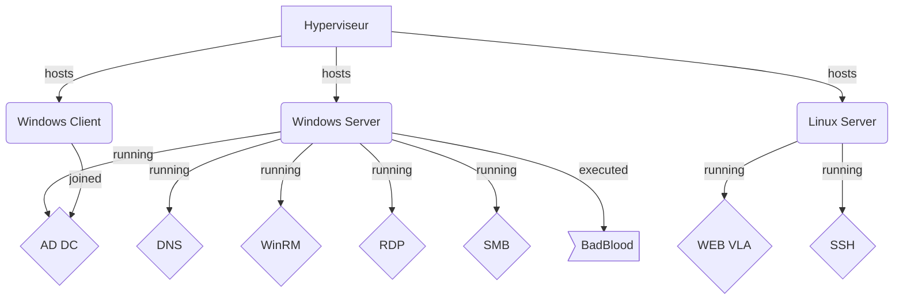

```mermaid
flowchart TD
    A[Hyperviseur] -->|hosts| W(Windows Server)
    A --> | hosts| C(Windows Client)
    A --> | hosts| L(Linux Server)

    W --> |running| Z{AD DC}
    W --> |running| E{DNS}
    W --> |running| F{WinRM}
    W --> |running| R{RDP}
    W --> |running| G{SMB} 
    W --> |executed| J>BadBlood] 

    L --> |running| H{WEB VLA}
    L --> |running| I{SSH}

    C --> |joined| Z
```
