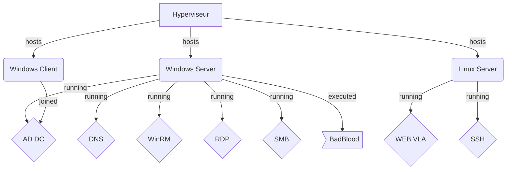

# Document d'Architecture Technique (DAT)

## 1. Architecture

### Schéma réseau


### Schéma des services




### Tableau des comptes administratifs

| Nom du compte        | Rôle                  | Localisation     | Stockage des identifiants                            |
|----------------------|-----------------------|------------------|------------------------------------------------------|
| Administrateur_AD    | Admin Windows AD      | DC1-SRVW19       | `\\DC1-SRVW19\C$\Keepass\kps_base.kdbx`         |
| root                 | Admin Linux           | Debian12.5       | `\\DC1-SRVW19\C$\Keepass\kps_base.kdbx`         |
|                      |                       |                  |                                                      |
|                      |                       |                  |                                                      |
|                      |                       |                  |                                                      |

---

## 2. Environnement

### Systèmes d’exploitation utilisés

- **Windows Server 2019** – Rôle : Active Directory, DNS, SMB, WinRM  
- **Windows 10 Pro** – Rôle : Workstation joignable au domaine  
- **Debian 12.5** – Rôle : Serveur Web avec l’application _VulnerableLightApp_

---

## 3. Exploitation

### Vérification des intégrités des images

> _Insère ici une capture d'écran de la vérification des hashs ou signatures des ISO._

---

### Mises à jour réussies

> _Insère ici une capture montrant les dernières mises à jour sur chaque OS._

---

### Statuts des services critiques

#### Services DNS et Web

> _Ajoute une capture montrant les services DNS actifs sur Windows Server et le statut du service Web (Kestrel) sur Debian._

---

### Connexions SSH et WinRM 

* Se conencter avec WinRM
```powershell
# Installation de WinRM
Enable-PSRemoting -Force

# Vérifier que WinRM est activé
Get-Service winrm

# Activer la règler de parefeu
Enable-NetFirewallRule -Name "WINRM-HTTP-In-TCP"

# Utilisation de WinRM pour des connexions distante
Enter-PSSession -ComputerName PC01-W10 -Credential nom_domaine\compte_admin

# Ouvrir (en admin) fenêtre GUI pour autoriser un compte en PSRemoting
Set-PSSessionConfiguration -Name Microsoft.PowerShell -ShowSecurityDescriptorUI
```


---

### Partages SMB/Samba

> _Montre les permissions des partages SMB configurés (readonly + écriture libre)._

---

### Nombre d'utilisateurs dans l’Active Directory

> _Capture du nombre total d’utilisateurs créés, y compris ceux générés par le script BadBlood._

---

### Diagramme de gestion de projet

> _Insère ici un Kanban ou un diagramme de Gantt représentant l’avancement du projet (réalisation, configuration, vérification)._

---

## Notes


