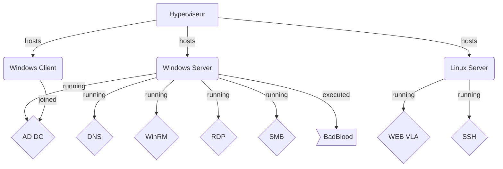
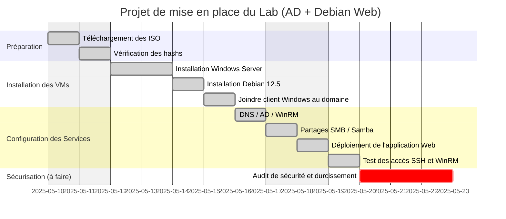

# Document d'Architecture Technique (DAT)

## 1. Architecture

### Schéma réseau


### Schéma des services




### Tableau des comptes administratifs

| Nom du compte        | Rôle              | Localisation   | Stockage des identifiants         |
|---------------------|------------------|----------------|---------------------------------------|
| Administrateur    | Admin Windows AD   | DC1-SRVW19     | `\\DC1-SRVW19\C$\Keepass\kps_base.kdbx`  |
| root                | Admin Linux        | Debian12.5     | `\\DC1-SRVW19\C$\Keepass\kps_base.kdbx`   |
|                     |                    |                |                                           |
|                     |                     |               |                                           |
|                      |                       |                 |                                          


## 2. Environnement

### Systèmes d’exploitation utilisés
|        OS                 | Hostname   |            Rôle                              |
|--------------------------|------------|---------------------------------------------------|                
| **Windows Server 2019**  | DC1-SRVW19 | Active Directory, DNS, SMB, WinRM                | 
|  **Windows 10 Pro**       | PC01-W10   | Workstation joignable au domaine                   | 
|  **Debian 12.5**         | DEB-APACHE | Serveur Web avec l’application _VulnerableLightApp_ | 

### Adressage IP

|        Hostname          |   IP        |  CIDR   |
|------------------------|--------------|---------|               
| **DC1-SRVW19**          | 10.0.0.1         | /24 |
|   **DEB-APACHE**        | 10.0.0.3        | /24 |
|  **PC01-W10**         | 192.168.200.100    |  /24 |

---

## 3. Exploitation

### Vérification des intégrités des images

* Vérifier un hash sous Windows
```powershell
Get-FileHash -Algorithm sha512 "F:\Users\Axel\Documents\Images ISO\Windows\Win 11\Win11_24H2_French_x64.iso"
```


* Vérifier un hash sous Linux
```bash
sha512sum "/tmp/debian.12.5.netinst.iso"
```
---

### Statuts des services critiques

#### Services DNS et Web

Vérification que le service web est lancé via dotnet
```bash
ps aux | grep dotnet
```


---

### Connexions SSH et WinRM réussies

* Se conencter avec WinRM
```powershell
# Installation de WinRM
Enable-PSRemoting -Force
# Vérifier que WinRM est activé
Get-Service winrm
# Activer la règler de parefeu
Enable-NetFirewallRule -Name "WINRM-HTTP-In-TCP"
# Utilisation de WinRM pour des connexions distante
Enter-PSSession -ComputerName PC01-W10 -Credential nom_domaine\compte_admin
# Ouvrir (en admin) fenêtre GUI pour autoriser un compte en PSRemoting
Set-PSSessionConfiguration -Name Microsoft.PowerShell -ShowSecurityDescriptorUI
```

---

### Partages SMB/Samba

## Partage samba

```batch
net use \\10.0.0.3 /user:axel
```


---

### Nombre d'utilisateurs dans l’Active Directory

* Afficher le nombre total d'utilisateur
```powershell
(Get-ADUser -Filter *).count
```

---

### Diagramme de gestion de projet


---

## Notes


