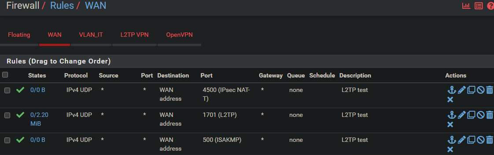
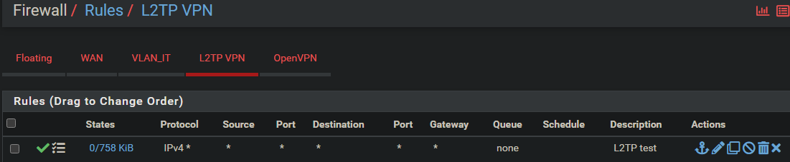

# L2TP VPN avec PfSense

### Configurer L2TP dans PfSense

* VPN → L2TP → Configuration
    * Cocher `Enable L2TP server`
    * Interface → WAN
    * Server address → choisir une IP
    * Remote address range → choisir une IP
    * Authentication type → MS-CHAPv2
    * Indiquer un serveur DNS
Puis sauvegarder


<br>


### Créer un utilisateur

VPN → L2TP → Users → Edit

Créer au moins un utilisateur + mdp qui sera demandé à la connexion clientes


<br>


### Rules

#### Règles sur l'interface WAN



Les règles `IPsec NAT-T` et `ISAKMP` ne sont pas obligatoires si l'IPsec n'est pas utilisé.

#### Règles sur L2TP VPN




<br>


### NAT Windows

Si les deux PC sont derrière NAT :

Créer cette clé registre SUR LE CLIENT :
```
reg add HKLM\SYSTEM\CurrentControlSet\Services\PolicyAgent /v AssumeUDPEncapsulationContextOnSendRule /t REG_DWORD /d 2 /f
```
Puis redémarrer.

<br>


### Configurer le VPN sur le CLIENT
```powershell
Add-VpnConnection `
-Name "VPN-LAB" `
-ServerAddress "192.168.0.24" `
-TunnelType L2tp `
-AuthenticationMethod MSChapv2 `
-EncryptionLevel Optional `
-Force
```

* `-ServerAddress` Ici c'est le WAN du PfSense (dans un cas réel ce serait donc l'IP publique)
* `-AuthenticationMethod MSChapv2, Pap` → j'ai retité Pap
* `-L2tpPsk "<key>"` → j'ai aussi retiré la clé PSK car j'arrivais pas à le faire fonctionner avec...


### Règles de parefeu pour ping une machine du réseau distant
```powershell
New-NetFirewallRule -DisplayName "Autoriser ICMPv4-In" -Protocol ICMPv4 -IcmpType 8 -Direction Inbound -Action Allow
New-NetFirewallRule -DisplayName "Autoriser ICMPv4-Out" -Protocol ICMPv4 -IcmpType 8 -Direction Outbound -Action Allow
```


