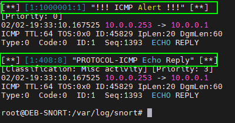

<h1 align="center"><strong>SNORT3 INITIAL CONFIGURATION</strong></h1>


<p align="center">
  
</p>


## __CONFIGURER LA CARTE RÉSEAU__

### Activation du mode promiscuous
```sh
ip link set dev enp0s3 promisc on
```

* En mode normal, une interface réseau ne traite que les paquets qui sont adressés spécifiquement à elle, plus les paquets de diffusion (broadcast) et de multidiffusion (multicast) auxquels elle est abonnée.

* En mode promiscuous, l'interface réseau traite tous les paquets qu'elle voit passer sur le réseau, indépendamment du fait qu'ils lui soient destinés ou non.


Vérifier le mode promiscuous

`ip link show enp0s3` ou `ip a`


<br>

### Désactiver l'interface Offloading (exemple pour enp0s3)

> [!NOTE] 
> * L’Interface Offloading est une série d’optimisations matérielles utilisées pour décharger le traitement des paquets vers la carte réseau, ce qui peut réduire la charge CPU. Cependant, ces options peuvent causer des problèmes avec Snort, notamment en tronquant les paquets de plus de 1518 octets, ce qui empêche Snort de capturer certaines menaces de manière complète.
> * Nous devons désactiver les fonctionnalités GRO (Generic Receive Offload) et LRO (Large Receive Offload), qui sont souvent activées par défaut sur les interfaces réseau.

<br>

Installer l'outils qui permet de désactiver ces fonctions 
```sh
apt install ethtool
```
Vérifier les paramètres d'optimisation de la réception des paquets sur l'interface (faire avant/ après pour voir la différence)
```sh
ethtool -k enp0s3 | grep receive-offload
```
Désactiver ces fonction
```sh 
ethtool -K enp0s3  gro off lro off  # désactive gro et lro
```

<br>

### Rendre la désactivation de l'Offloading permanent

Les configurations effectuées pour le mode promiscuous et la désactivation de l’offloading peuvent être temporaires et réinitialisés après un redémarrage. Pour rendre ces modifications permanentes on créé un service. (exemple de fichier de service pour enp0s3)

```sh
cat << EOF > /etc/systemd/system/promisc-mode.service
[Unit]
Description=Set Snort 3 NIC in promiscuous mode and Disable GRO, LRO on boot
After=network.target

[Service]
Type=oneshot
ExecStart=/usr/sbin/ip link set dev enp0s3 promisc on
ExecStart=/usr/sbin/ethtool -K enp0s3 gro off lro off
TimeoutStartSec=0
RemainAfterExit=yes

[Install]
WantedBy=default.target
EOF
```

Activer et redémarrer le service
```sh
systemctl daemon-reload
systemctl start promisc-mode.service
systemctl enable --now promisc-mode.service
```

Vérifier le service
```sh
systemctl status promisc-mode.service
```
Le service est de type oneshot → il s’exécute puis se termine (active (exited) = OK) <br>
systemd lit les services en root (ne pas mettre snort propriétaire)


<br>


## __STRUCTURE DES RÈGLES__

| Action | Proto| Src IP | Src Port | Dir | Dst IP | Dst Port | Options |
|:------:|:----:|:------:|:--------:|:---:|:------:|:--------:|---------|
| alert  | icmp | any    | any      | ->  | any    | any      | (msg:"!!! ICMP Alert !!!"; sid:1000001; rev:1; classtype:icmpevent;) |
| alert  | tcp  | any    | any      | ->  | any    | 445      | (msg:"Possible NTLM auth over SMB"; content:"NTLMSSP"; sid:1000002; rev:1;) classtype:credential-harvest; |

<br>

* Les options sont matérialisées par un bloc entre parenthèses contenant différents sous `Labels` 

* Les `Labels` sont à la fois des critères de détection (content, pcre, flow) et des métadonnées d’alerte (msg, sid, classtype)

* Ces `Labels` sont extraits et convertis (JSON, syslog, CEF, Elastic) puis utilisés par les systèmes de journalisation et les SIEM.

<br>

> [!NOTE]
> * L'ordre des labels n'est pas strict sauf pour certaines options de détection (content, pcre, flow).
> * Bonnes pratiques pour les N° des règles : `< 1 000 000` → réservé Snort officiels et `> 1 000 000` → règles custom  

Exemples de Labels destinés aux SIEM 

| msg    | Message lisible humain  |                 
| --------- | ---------------------- |
| sid       | ID unique de la règle  |
| rev       | Version de la règle    | 
| classtype | Catégorie de l’attaque | 
| priority  | Gravité                | 

Exemples de Labels destinés à la détection 

| content   | Cherche une chaîne précise dans le paquete (string)  |
| --------- | ---------------------- |
| pcre      | Regex avancée  (attaques plus complexes)        |
| flow      | Sens + état de la connexion/du flux (to_server, established…)    | 
| nocase    | Ignore la casse lors de la détection  |


<br>

Exemple des labels en JSON:
```json
{
  "timestamp": "2026-02-03T15:42:11",
  "sid": 1000002,
  "rev": 1,
  "msg": "Possible NTLM auth over SMB",
  "classtype": "credential-harvest",
  "src_ip": "10.0.0.12",
  "dst_ip": "10.0.0.5",
  "dst_port": 445,
  "protocol": "tcp"
}
```


<br>


## __FICHIER DE RÈGLES PERSONNALISÉES__


### Création du répertoire de règles
```sh
mkdir /etc/snort/rules
```

### Créér le fichier de règle
```sh
cat << EOF >> /etc/snort/rules/local.rules
# ----------------
# LOCAL RULES
# ----------------
# This file intentionally does nots come with signatures. Put your local additions here.

alert icmp any any -> any any (msg:"!!! ICMP Alert !!!";sid:1000001;rev:1;classtype:icmpevent;)
EOF
```

### Configuration des règles dans le fichier de conf snort.lua
```sh
nano /etc/snort/snort.lua
```

Dans la section `5. configure detection`:

* Décommenter la ligne "enable_builtin_rules = true,"
* Ajouter la ligne "include = "/etc/snort/rules/local.rules","

```lua
{
    -- use this to enable decoder and inspector alerts
    enable_builtin_rules = true,

    -- use include for rules files; be sure to set your path
    -- note that rules files can include other rules files
    -- (see also related path vars at the top of snort_defaults.lua)

    variables = default_variables,

    rules = [[
      include /etc/snort/rules/local.rules
    ]]

}
```

Re-tester le fichier snort.lua
```sh
snort -c /usr/local/etc/snort/snort.lua -T
```


<br>


##  __RÈGLES OFFICIELLES__

### Télécharger les règles dans le répertoire /etc/snort/rules (Créer un compte sur le site de snort si besoin)
```sh
cd
wget https://www.snort.org/downloads/community/snort3-community-rules.tar.gz
tar -xvf snort3-community-rules.tar.gz
mv snort3-community-rules/snort3-community.rules /etc/snort/rules
```

### Configuration des règles dans le fichier de conf snort.lua
```sh
nano /etc/snort/snort.lua
```

Dans la section -- 5. configure detection
* Ajouter la ligne "include = "/etc/snort/rules/snort3-community.rules"," sous la ligne du fichier local.rules comme suit
```sh
    rules = [[
      include /etc/snort/rules/local.rules
      include /etc/snort/rules/snort3-community.rules
    ]]
```

### Copier les règles déjà présente lors de l'install vers le dossier adéquat
```sh
cp -r /usr/local/etc/snort/* /etc/snort/
```


<br>


## __CONFIGURER LES LOGS__


### Création du répertoire
```sh
mkdir /var/log/snort
chmod 660 /var/log/snort
```

### Modification du fichier de configuration de Snort
```sh
nano /etc/snort/snort.lua
```

> On peut activer par défaut le mode "alert_full" et le logging "log_pcap" sans avoir besoin de mettre l'option `-A` ou `-L` (facultatif)

Se rendre en bas du fichier dans la catégorie `7. configure outputs` (décommenter alert_full et log_pcap)
```ini
alert_full = { file = true, limit = 100000 }

-- alert_json = { file = true, limit = 100000, fields = 'timestamp msg pkt_num proto pkt_gen pkt_len dir src_addr src_port dst_addr dst_port service rule priority class action b64_data' }

--alert_sfsocket = { }
--alert_syslog = { }
--unified2 = { }

-- packet logging
-- you can enable with defaults from the command line with -L <log_type>
--log_codecs = { }
--log_hext = { }

log_pcap = { limit = 100000 }
```


<br>


## __TESTER__

### Tester le fichier de configuration
```sh
snort -c /etc/snort/snort.lua -i enp0s3 -l /var/log/snort -T
```

### Tester le fonctionnement par défaut 

* Lancer un ping à destination de votre machine
* Lancer la capture Snort avec les paramètres par défaut
```sh
snort -c /etc/snort/snort.lua -i enp0s3 -l /var/log/snort
```

Les fichiers `alert_full.txt` et `log.pcap.*.txt` doivent apparaître dans /var/log/snort
```sh
tail /var/log/snort/alert_full.txt
```
Voir les logs en temps réel:
```sh
tail -f /var/log/snort/alert_full.txt
```
Ici on voit la règle personnalisée créée précédemment et une alerte d'une autre règle par défaut




<br>


## __CRÉÉR LE SERVICE SNORT__


Par défaut Snort 3 est utilisable uniquement de manière interactive via la CLI. Pour automatiser sont lancement/arrêt, il est nécessaire de créer un service à ce effet.

Commande de base à utiliser <br>

### Valider le fonctionnement de la commande de base qui sera lancée en tant que service
```sh
snort -c /etc/snort/snort.lua -i enp0s3 -s 65535 -k none -l /var/log/snort
```


### Création de l'utilisateur snort

Cet utilisateur sera destiné au service Snort (il est recommandé d'exécuter le service Snort avec un compte utilisateur dédié et à privilèges limités pour des raisons de sécurité)
```sh
useradd -r -s /usr/sbin/nologin -M snort
```


### Adapter les droits sur le répertoire pour permettre à l'utilisateur d'enregistrer les logs
```sh
chmod -R 2775 /var/log/snort
chown -R snort:snort /var/log/snort
```

> [!NOTE] 
> * Rappel pour le 1er chiffre de chmod
>   * 2 = setgid (Sur un dossier les fichiers héritent du groupe du dossier)
>   * 4 = setuid (Sert aux binaires, le programme s’exécute avec l’UID du propriétaire)
>   * 5 = setuid + setgid (inutile sur un dossier car sera ignoré)
>   * 1 = sticky bit


### Création du fichier de service
```sh
cat << EOF > /etc/systemd/system/snort3.service
[Unit]
Description=Snort3 IDS Daemon Service
After=syslog.target network.target

[Service]
Type=simple
ExecStart=/usr/local/bin/snort -c /etc/snort/snort.lua -i enp0s3 -s 65535 -k none -l /var/log/snort -m 0x1b -u snort -g snort
# ExecStop=/bin/kill -9 $MAINPID
Restart=on-failure

[Install]
WantedBy=multi-user.target
EOF
```

Initialment on peut mettre l'option `-D` après `/var/log/snort` ligne `ExecStart` mais j'avais des erreurs, pour rectifier j'ai commenté `ExecStop` et ajouté `Restart=on-failure` (il semblerait que systemd tente de kill un process qui n'existait pas et faisait planter le service)


### Recharger pour activer le service Snort
```sh
systemctl daemon-reexec
systemctl daemon-reload
systemctl enable --now snort3
```

### Démarrez le service Snort et vérifier son état 
```sh
service snort3 start
service snort3 status
```
ou
```sh
systemctl start snort3
systemctl status snort3
ps aux | grep snort
```